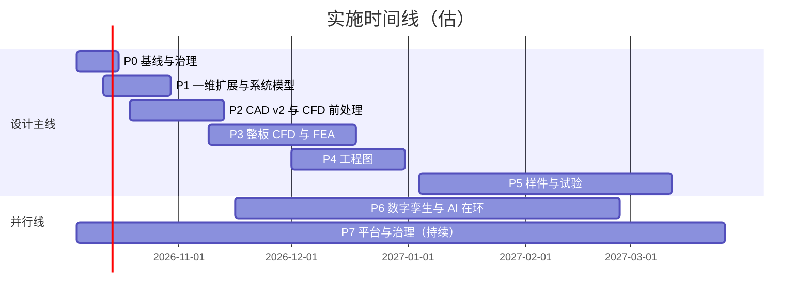

# AI 算力芯片冷板液冷设计平台 · 实施计划 v1.0

| 项 | 内容 |
|---|---|
| 文档号 | AIDC-CP-PLAT-IMPL-001 |
| 版本 / 日期 | v1.0 · 2026-10-02 |
| 状态 | 计划草案。按用户指令逐步执行，每次一个或一组步骤 |
| 配套文件 | `plan/项目规划_液冷设计平台_v1.0_20261002.md`（同名 .html） |
| 环境标记 | [直接] 当前环境可直接执行（Python / `cad/.venv`，无商业许可）；[MATLAB] 依赖 MATLAB 及工具箱许可；[ANSYS] 依赖 ANSYS 2026 R1 对应模块许可；[商业CAD] 依赖 NX / SolidWorks 等；[实物] 需要样件、台架或外协；[人工] 需要用户决策或签字 |
| 路径约定 | 未注明前缀的路径相对 `agents/AIDCtms/coolingplate/agent/practice01_0926/`；`cad/`、`design/` 指冷板根目录 `agents/AIDCtms/coolingplate/` 下的同名目录 |

## 1 执行协议

### 1.1 用户怎么下指令

- "执行 S03" 或 "执行 S01–S04"：智能体按步骤卡执行，完成后汇报。
- "S05 先给 diff"：凡是要修改已有文件的步骤，先给改动预览，用户确认后再写。
- "认可 S03 的技能候选"：把该步骤产生的候选技能或记忆写入 `skills/` / `memory/`。
- "跳过 / 改顺序"：依赖关系见每张步骤卡；跳过时智能体说明受影响的后续步骤。

### 1.2 每一步的标准动作

1. 读 `platform/CLAUDE.md`、`agent.md`、相关技能和未过期记忆；核对步骤卡的依赖是否已完成。
2. 说明本步骤要用的设计口径 id 和几何轨道。
3. 在 `runs/<YYYYMMDD-HHMMSS>-<stage>-<tag>/` 下工作，写 `manifest.json`（S06 之前先手写同样字段）。
4. 执行动作；遇到闸门停下等确认。
5. 汇报：结论先行 + 证据等级 + 数字与来源 + 未关闭项 + 候选技能 / 记忆（只列出，不入库）。
6. 关键步骤完成后给出 git 提交建议，真实 push 由用户执行。

### 1.3 完成定义（DoD）

- 产出文件存在于步骤卡写明的路径，manifest 字段完整。
- 验收标准逐条给出"通过 / 未通过 / 不适用"及证据。
- 没有改动冻结件（`cad/params/cp_b300_jm01.yaml`、`cad/out` 已发放 STEP、references 原文）。
- 候选技能和记忆已列出，等待用户认可。

## 2 总览

### 2.1 阶段与 Sprint

| Phase | 名称 | 时间窗（估） | 步骤 | 主要闸门 |
|---|---|---|---|---|
| P0 | 基线与治理 | 2026-10-05 至 10-16 | S01–S06 | DR0 / DR2 复核准备 |
| P1 | 需求、选型与一维 | 2026-10-12 至 10-30 | S07–S13 | DR0、DR1、DR2 复核 |
| P2 | CAD v2 与 CFD 前处理 | 2026-10-19 至 11-13 | S14–S18 | — |
| P3 | 三维仿真与结构 | 2026-10-26 至 12-18 | S19–S29 | DR3 仿真评审 |
| P4 | 工程图 | 2026-12-01 至 2027-01-08 | S30–S33 | DR3 闸门 |
| P5 | 样件与试验 | 2027-01-04 至 03-12 | S34–S38 | DR4 送样放行 |
| P6 | 数字孪生与 AI 在环 | 2026-11-16 至 2027-02-26 | S39–S43 | — |
| P7 | 平台与治理（持续） | 2026-10-05 至 2027-03-26 | S44–S46 | 各闸门后 |

<!-- FIG:gantt -->

### 2.2 步骤总表

| 编号 | 名称 | Phase | 环境 | 工时 / h | 依赖 | 闸门 |
|---|---|---|---|---|---|---|
| S01 | 环境与许可核验 | P0 | [直接] | 2 | — | — |
| S02 | 设计口径登记册 | P0 | [直接] [人工] | 4 | — | 用户指定主口径 |
| S03 | 一维回归基线 | P0 | [直接] | 4 | — | — |
| S04 | 记忆与文档体检 | P0 | [直接] | 2 | — | 修改前确认 |
| S05 | 一维工质与 v2.1 设计点参数化 | P0 | [直接] | 8 | S02、S03 | 改已有文件先给 diff |
| S06 | 工件清单 manifest 工具 | P0 | [直接] | 4 | — | — |
| S07 | DR0 输入追溯矩阵数字化 | P1 | [直接] [人工] | 4 | S02 | DR0 复核 |
| S08 | DR1 权衡矩阵与 FTO 对照草稿 | P1 | [直接] [人工] | 4 | S07 | 法务确认 FTO |
| S09 | 一维扫描与差距闭合工具 | P1 | [直接] | 6 | S05 | — |
| S10 | PG25 压降预算与 Grace 孔板重配 | P1 | [直接] | 4 | S05 | — |
| S11 | MCP 与设计台同步 | P1 | [直接] | 6 | S05、S09 | 改已有文件先给 diff |
| S12 | 托盘 / 冷板水力网络 Simscape 模型 | P1 | [MATLAB] | 12 | S01、S02 | — |
| S13 | 一维交叉核对与 DR2 复核包 | P1 | [直接] [人工] | 4 | S09、S10（S12 可选） | DR2 复核 |
| S14 | CAD 内核 v2：pitch_x / pitch_y | P2 | [直接] [人工] | 12 | S02 | 写入内核前确认 |
| S15 | v2 轨道接入 MCP 与设计台 | P2 | [直接] | 6 | S14 | 改已有文件先给 diff |
| S16 | 流体域与命名面导出 | P2 | [直接]（SpaceClaim 可选 [ANSYS]） | 8 | S14 | 导出 confirm |
| S17 | Grace 概念接入规则门 | P2 | [直接] | 8 | S02 | 写入 cad/ 前确认 |
| S18 | HBM 区候选几何 | P2 | [直接] | 8 | S14 | 用户选方案 |
| S19 | UC-01b 12 层续算收口 | P3 | [直接]（只读日志） | 3 | — | — |
| S20 | CFD 作业适配器 | P3 | [ANSYS] | 12 | S01、S06 | 安装 PyFluent 需确认 |
| S21 | V1 基准与 V4 锚定算例 | P3 | [ANSYS] | 10 | S20 | 提交作业确认 |
| S22 | 单胞网格无关性与模型敏感性 | P3 | [ANSYS] | 12 | S20 | 提交作业确认 |
| S23 | 孔径统一：D0.40 / D0.50 单胞对比 | P3 | [ANSYS] | 8 | S22 | 用户定孔径 |
| S24 | 1/2 整板共轭模型 C01 | P3 | [ANSYS] | 24 | S16、S22 | 提交作业确认 |
| S25 | 工况矩阵 C01–C12 与 PG25 点 | P3 | [ANSYS] | 16 | S24 | 提交作业确认 |
| S26 | 后处理、Q1–Q8 符合性与取图 | P3 | [ANSYS] | 16 | S25 | — |
| S27 | 回路 1 自动化 | P3 | [直接] | 8 | S09、S26 | 选杠杆需确认 |
| S28 | 结构 FEA：承压、压装、热变形 | P3 | [ANSYS] | 12 | S14 | 安装 PyMAPDL 需确认 |
| S29 | DR3 仿真评审包 | P3 | [直接] [人工] | 6 | S26、S28 | DR3 仿真评审 |
| S30 | 2D 评审级图纸自动生成 | P4 | [直接] | 12 | S14 | — |
| S31 | 3D / 爆炸图与 BOM | P4 | [直接] | 6 | S30 | — |
| S32 | GD&T、检验要求表与发放级图纸 | P4 | [商业CAD] [人工] | 8 | S30、S31 | 发放签字 |
| S33 | DR3 闸门评审 | P4 | [人工] | 2 | S29、S32 | DR3 闸门 |
| S34 | 试验大纲与 TTV 设计 | P5 | [直接] | 12 | S13 | 用户 / 试验方认可 |
| S35 | 铜样与透明流道样先行验证 | P5 | [实物] [人工] | 6 + 外协 | S30、S34 | 下单由人 |
| S36 | 试验数据格式与导入工具 | P5 | [直接] | 6 | S34 | — |
| S37 | V&V 比对与回路 2 | P5 | [直接] | 8 | S26、S36 | 修正模型需确认 |
| S38 | DR4 送样放行包 | P5 | [人工] [实物] | 4 | S37 | DR4 |
| S39 | L1 RC 热网络 + 水力网络（Python） | P6 | [直接] | 10 | S05、S19 | — |
| S40 | Simscape 孪生与 FMU 导出 | P6 | [MATLAB] | 12 | S12、S39 | — |
| S41 | CFD DOE 与 L2 降阶模型 | P6 | [ANSYS]（训练 [直接]） | 16 | S22、S24 | 提交作业确认 |
| S42 | AI 在环控制 SIL | P6 | [MATLAB] 或 [直接] | 16 | S39（S40 可选） | 实物动作闸门 |
| S43 | 孪生 V&V 与运行接口草案 | P6 | [直接] | 6 | S41、S42 | — |
| S44 | 设计台：闸门看板与工件浏览 | P7 | [直接] | 12 | S06、S11 | 改已有文件先给 diff |
| S45 | 技能与记忆沉淀（每个闸门后） | P7 | [人工] | 约 10 | 各闸门 | 用户认可 |
| S46 | 发布提交建议 | P7 | [人工] | 约 4 | 各关键步骤 | 人执行 push |

工时合计约 375 h（不含 CFD 计算机时与外协周期）。CFD 机时另计：单胞每个算例约数小时，1/2 整板每个算例约 1–3 天（取决于 HPC 核数），工况矩阵整体以周计。

### 2.3 当前环境可执行性

| 类别 | 步骤 | 说明 |
|---|---|---|
| 当前可直接执行 | S01–S11、S13–S19、S27、S29–S31、S34、S36、S37、S39、S43、S44 | 只需 Python、`cad/.venv` 与已有文件；改已有文件的步骤先给 diff |
| 依赖 MATLAB | S12、S40、S42（MATLAB 路线） | 目录已装 Simscape Fluids、MPC、RL；许可由 S01 核验 |
| 依赖 ANSYS | S20–S26、S28、S41；S16 的 SpaceClaim 选项 | Fluent、Mechanical、SpaceClaim、TwinAI 已装；许可与 HPC 核数由 S01 核验 |
| 依赖商业 CAD | S32 | NX / SolidWorks 本机未发现 |
| 依赖实物 / 外协 | S35、S38 | 样件、TTV、流阻台、红外、氦检 |
| 需要人工决策 | S02、S07、S08、S13、S14、S23、S29、S32、S33、S38、S45、S46 | 见各步骤闸门 |

### 2.4 首批建议执行顺序

| 顺序 | 步骤 | 理由 |
|---|---|---|
| 1 | S01 环境与许可核验 | 决定后续 MATLAB / ANSYS 路线和降级方案，2 小时内完成 |
| 2 | S02 设计口径登记册 | 消除水 / PG25 两套口径混用（风险 R-03），之后所有计算都带口径 id |
| 3 | S03 一维回归基线 | 改工具前先把 v2.0 数字锁成测试，防止回归 |
| 4 | S04 记忆与文档体检 | 只读体检，列出过期、损坏、漂移项 |
| 5 | S05 一维工质与 v2.1 设计点参数化 | 让工具支持 PG25 与 v2.1；改已有文件，先给 diff |
| 机会项 | S19 UC-01b 12 层续算收口 | 只读日志，可与上面任一步并行 |

## 3 Phase 0 · 基线与治理

#### S01 环境与许可核验 [直接]

| 项 | 内容 |
|---|---|
| 目标 | 弄清 MATLAB、ANSYS 各模块是否真能用，确定主路线与降级路线 |
| 输入 | `memory/semantic/environment.md`；本规划 0.3 节的目录探测结果 |
| 动作 | ① `matlab -batch` 调 `license('test', ...)` 检查 Simulink、Simscape、Simscape_Fluids、MPC、RL、Optimization、Simulink_Compiler（FMU 导出）；② 用 ANSYS 许可客户端查询 Fluent、HPC、Mechanical、SpaceClaim、optiSLang、TwinAI 的特性与数量；③ 列出 Python 包版本；④ 记录 GPU 空闲显存 |
| 产出 | `runs/<ts>-env-check/env_report.json`、`env_report.md` |
| 验收 | 每个模块给出"可用 / 不可用 / 未知"和证据（命令输出摘要）；给出降级路线建议 |
| 闸门 | 无。不安装任何软件 |
| 工时 | 2 h |
| 依赖 | — |
| 候选沉淀 | `memory/semantic/tool-licenses.md`（用户确认后） |

#### S02 设计口径登记册 [直接] [人工]

| 项 | 内容 |
|---|---|
| 目标 | 把 v2.0 水、v2.1 PG25、Grace v1.0 / v1.1 四套口径写成机器可读的登记册，每个数字带来源章节 |
| 输入 | references 下 B300 v2.0 §1–§9、v2.1 §1–§4、Grace v1.0 §2–§5、v1.1 §0–§3；`design/calc/model.py` 的 DESIGN_POINTS |
| 动作 | 起草 `knowledge/design-basis.json`（DB-B300-W1100、DB-B300-PG1400、DB-GRACE-W300、DB-GRACE-PG300）：工质物性、功率拆分、流量与分流、目标值（Rθ、ΔP、流速帽、温升）、几何引用、来源；写 `basis.py` 读取与校验（功率闭合、流量闭合检查） |
| 产出 | `knowledge/design-basis.json`、`basis.py`、`tests/test_basis.py` |
| 验收 | 功率闭合（429×2+198+44=1100；910+350+140=1400；260+40=300）；每个字段有 `source`；测试通过 |
| 闸门 | 用户指定主口径（规划 Q-01） |
| 工时 | 4 h |
| 依赖 | — |
| 候选沉淀 | 技能 `design-basis`；记忆 `semantic/design-basis.md` |

#### S03 一维回归基线 [直接]

| 项 | 内容 |
|---|---|
| 目标 | 把现有 oned / zones 的输出锁成回归测试，作为改造前的基准 |
| 输入 | `oned.py`、`zones.py`、`cycle-20260926/out/cycle.json`、v2.0 §9 表格 |
| 动作 | 用 DP-A、DP-B、D0.40、HBM DP-A / DP-B、Grace 0.5427 / 0.70 L/min 调用三个函数；与 cycle.json 和 v2.0 数字对表；写 pytest |
| 产出 | `tests/test_oned_regression.py`、`runs/<ts>-oned-baseline/baseline.json` |
| 验收 | 复现 Rθ 0.0326 / 0.0366（DP-A）、0.0311 / 0.0351（DP-B）、孔速 0.629 m/s、Re 478、板内压降 3.52–5.52 kPa、HBM 0.463 m/s、Grace CPU 槽 0.34 m/s 与 0.96 kPa 量级；相对误差 < 0.5% |
| 闸门 | 无 |
| 工时 | 4 h |
| 依赖 | — |
| 候选沉淀 | 无（测试本身即资产） |

#### S04 记忆与文档体检 [直接]

| 项 | 内容 |
|---|---|
| 目标 | 找出过期、损坏、口径过时和文档漂移的条目 |
| 输入 | `memory/`、`knowledge/`、`README.md`、`skills/`、`mcp/server.py` |
| 动作 | 检查 confidence / valid_until / last_verified；核对 index.json 继承项是否存在且未损坏；对比 README 工具清单（5 个）与 server.py（8 个）；列出技能中会过时的"当前算例"描述 |
| 产出 | `runs/<ts>-memory-audit/audit.md`（只读报告，附修改建议） |
| 验收 | 每条记忆一行结论；修改建议逐条可执行 |
| 闸门 | 任何修改需用户逐条确认后再做 |
| 工时 | 2 h |
| 依赖 | — |
| 候选沉淀 | 更新后的 index.json、README（用户确认后） |

#### S05 一维工质与 v2.1 设计点参数化 [直接]

| 项 | 内容 |
|---|---|
| 目标 | 让一维工具支持 PG25、v2.1 设计点和 HBM 中心进液，且不破坏 v2.0 结果 |
| 输入 | S02 登记册；S03 回归测试；v2.1 §1–§4；`design/calc/model.py` 的 PG25_40 |
| 动作 | oned / zones 增加 `basis` 或 `fluid` 参数（默认保持水 DP-A）；增加 v2.1 设计点（GPU 2.283 L/min、单颗 HBM 0.1096 L/min）；HBM 中心进液模型（7×0.80×2.00，腿长 5.5 mm）；Grace PG25；新准则 `JET_V_CAP`（孔速 ≤ 2.0 m/s） |
| 产出 | 修改 `oned.py`、`zones.py`（先 diff）；`tests/test_oned_pg25.py` |
| 验收 | S03 回归全过；复现 v2.1：0.50 mm @ 2.283 L/min 孔速 0.897 m/s，@ 2.4 / 2.6 L/min 为 0.943 / 1.022 m/s、Re 419 / 454、孔口 0.82 / 0.96 kPa；HBM 0.1096 L/min 满截面 0.163、腿内 0.082 m/s；Grace PG25 0.8 L/min CPU 槽 0.502 m/s、2.44 kPa |
| 闸门 | 修改已有文件，先给 diff，用户确认 |
| 工时 | 8 h |
| 依赖 | S02、S03 |
| 候选沉淀 | 记忆 `semantic/pg25-oned.md`；`design-loop` 技能更新 |

#### S06 工件清单 manifest 工具 [直接]

| 项 | 内容 |
|---|---|
| 目标 | 所有运行目录自动写 manifest.json，实现追溯 |
| 输入 | 规划 4.4 节字段定义 |
| 动作 | 写 `artifacts.py`：创建 run 目录、写 manifest、计算输入 sha256、登记父级与证据等级；提供 `list_runs` 与追溯查询 |
| 产出 | `artifacts.py`、`tests/test_artifacts.py` |
| 验收 | 新建、查询、追溯父链三项测试通过；与现有 `runs/20260926-140511/` 兼容（可补写 manifest） |
| 闸门 | 无 |
| 工时 | 4 h |
| 依赖 | — |
| 候选沉淀 | 技能 `artifact-manifest`（连续 10 次运行字段完整后） |

## 4 Phase 1 · 需求、选型与一维

#### S07 DR0 输入追溯矩阵数字化 [直接] [人工]

| 项 | 内容 |
|---|---|
| 目标 | 把 v2.0 §3.1 输入矩阵、§3.3 假设登记册、§13 开放项变成可更新的数据和报告 |
| 输入 | v2.0 §3、§13；v2.1 §7；Grace v1.0 §8；S02 登记册 |
| 动作 | 生成 `dr0_inputs.json`（IN-T1…T6、IN-H1…H6、IN-M1…M5、IN-R1…R3、AS-1…8、C-01…10），字段：取值、来源、状态、影响章节、责任人、计划日期；出 HTML 报告与缺口清单 |
| 产出 | `runs/<ts>-req-dr0/dr0_inputs.json`、`dr0_report.html` |
| 验收 | 条目数与 v2.0 一致；缺失项全部有责任人栏（可为"待用户指定"） |
| 闸门 | DR0 复核由用户签字 |
| 工时 | 4 h |
| 依赖 | S02 |
| 候选沉淀 | 技能 `requirements-trace` |

#### S08 DR1 权衡矩阵与 FTO 对照草稿 [直接] [人工]

| 项 | 内容 |
|---|---|
| 目标 | 复核 v2.0 §5.1 权衡矩阵并做权重敏感性；把方案 A 必要特征映射到几何参数；起草 FTO 对照表 |
| 输入 | v2.0 §5.1–5.2；专利报告 §3.6、§6.2、§7；技术调查 §5.7–5.8 |
| 动作 | 写可复算矩阵（4.50 / 3.20 / 2.95 / 2.85）；权重 ±10% 敏感性；方案 A 特征表（HBM 无喷嘴、近壁流速上限 0.80、隔离肋 2.0 mm、ΔP ≤ 20 kPa）与几何字段对应；六件专利对照草稿 |
| 产出 | `runs/<ts>-concept-dr1/tradeoff.json`、`fto_draft.md`、`dr1_report.html` |
| 验收 | 复现 v2.0 得分；敏感性下排名是否稳定写清；FTO 草稿标明"非法律意见" |
| 闸门 | 法务 / 用户确认 FTO 结论 |
| 工时 | 4 h |
| 依赖 | S07 |
| 候选沉淀 | 技能 `tradeoff-matrix` |

#### S09 一维扫描与差距闭合工具 [直接]

| 项 | 内容 |
|---|---|
| 目标 | 批量扫描孔径、流量、TIM2、孔数、喷距、槽深，复现并扩展 v2.0 §9.10–9.11 |
| 输入 | S05 后的 oned / zones；S02 登记册 |
| 动作 | 写 `sweep.py`：网格扫描与单因素敏感性；输出 CSV、PNG；差距闭合（所需 h 对比保守模型 25,477 W/m²K）；水与 PG25 两套 |
| 产出 | `sweep.py`、`tests/test_sweep.py`、`runs/<ts>-oned-sweep/`（CSV、PNG、summary.md） |
| 验收 | 复现 v2.0 §9.10 孔径表（0.30–0.50 mm 的孔速、Re、孔口压降）与 §9.11 所需 h（DP-A：38,716 / 34,555 / 31,201 / 28,441）；1000 点扫描 < 1 min |
| 闸门 | 无 |
| 工时 | 6 h |
| 依赖 | S05 |
| 候选沉淀 | 技能 `oned-sweep` |

#### S10 PG25 压降预算与 Grace 孔板重配 [直接]

| 项 | 内容 |
|---|---|
| 目标 | 给出 PG25 设计流量下 B300 板内压降的分段估算，以及 Grace 孔板在 0.753 L/min 下配到 8–12 kPa 的孔径候选 |
| 输入 | v2.1 §3（外推 14–24 kPa）；Grace v1.1 §3（4×Ø1.04 → 22.9 kPa）；S05 工具 |
| 动作 | 按分段（孔口、短槽、HBM、静压箱估值）重算 3.512 L/min PG25；静压箱项标为 E0 估值并给出 CFD 替换计划；Grace 四孔孔径反算（Cd 0.62） |
| 产出 | `runs/<ts>-oned-dp-pg25/dp_budget.md`、`grace_orifice.json` |
| 验收 | 每个分段标明模型和证据等级；Grace 新孔径给出水与 PG25 两种工况下的支路压降 |
| 闸门 | 无（孔径只是候选，冻结要等托盘实测） |
| 工时 | 4 h |
| 依赖 | S05 |
| 候选沉淀 | 记忆 `semantic/grace-and-tray.md` 更新（用户确认后） |

#### S11 MCP 与设计台同步 [直接]

| 项 | 内容 |
|---|---|
| 目标 | MCP 和设计台跟上 S02 / S05 / S09：口径切换、PG25、扫描页；README 工具清单更新 |
| 输入 | `mcp/server.py`、`ui/`、`README.md` |
| 动作 | MCP 新增 `design_basis`、`oned_sweep`；现有三个一维工具增加 `basis` 参数；UI 新增口径下拉与扫描页；README 列全工具 |
| 产出 | 修改 `mcp/server.py`、`ui/index.html`、`ui/app.js`、`README.md`（先 diff） |
| 验收 | `server.py --self-test` 通过；HTTP 8765 下新页面可用；旧接口不带 basis 时行为不变 |
| 闸门 | 修改已有文件先给 diff |
| 工时 | 6 h |
| 依赖 | S05、S09 |
| 候选沉淀 | 无 |

#### S12 托盘 / 冷板水力网络 Simscape 模型 [MATLAB]

| 项 | 内容 |
|---|---|
| 目标 | 建立托盘级水力网络（4 块 B300 + 2 块 Grace 并联、孔板、UQD 4–8 kPa、PG25 / 水），为孪生和控制做准备 |
| 输入 | S02 登记册；v2.0 §7.1；Grace v1.0 §3；S10 结果 |
| 动作 | 经 `ai-matlab` 智能体与 `user-matlab` MCP 建 Simscape Fluids（Thermal Liquid）模型；冷板用一维压降–流量曲线与热阻集总参数；跑稳态与流量分配 |
| 产出 | `twin/simscape/tray_hydraulic.slx`、`runs/<ts>-oned-simscape/compare.md` |
| 验收 | 单板稳态压降与 Python 一维差 < 5%；四板均流偏差报告；Grace 孔板配平点与 S10 一致 |
| 闸门 | 无（许可不可用则改 Python ODE，见规划 2.10） |
| 工时 | 12 h |
| 依赖 | S01、S02 |
| 候选沉淀 | 无（进入 S40 后再沉淀） |

#### S13 一维交叉核对与 DR2 复核包 [直接] [人工]

| 项 | 内容 |
|---|---|
| 目标 | 按主口径出 DR2 复核包：热阻预算、敏感性、差距闭合、压降、流速帽 |
| 输入 | S09、S10（S12 可选） |
| 动作 | 写 `reports/gate.py` 的 DR2 模板；汇总各口径结果；列出转入 CFD 的理由与问题清单（对应 v2.0 §10.1 Q1–Q8） |
| 产出 | `reports/gate.py`、`runs/<ts>-oned-dr2/dr2_report.html` |
| 验收 | 每条判据有数字、来源、证据等级；与 v2.0 §0.2 放行判据表结构一致 |
| 闸门 | DR2 复核由用户签字 |
| 工时 | 4 h |
| 依赖 | S09、S10 |
| 候选沉淀 | 技能 `gate-review` |

## 5 Phase 2 · CAD v2 与 CFD 前处理

#### S14 CAD 内核 v2：pitch_x / pitch_y [直接] [人工]

| 项 | 内容 |
|---|---|
| 目标 | 让参数化内核表达 v2 的 216 孔（每 die 9×12、Sx 3.0 × Sy 2.4），v1 冻结件不动 |
| 输入 | `cad/coldplate/`（model、rules、geometry、backends）；`knowledge/cad-kernel-gap.md`；v2.0 §8.1 锁定坐标表 |
| 动作 | 新增 `jets.pitch_x`、`jets.pitch_y`（缺省回落到 `jets.pitch`）；新建候选参数 `cad/params/cp_b300_jm01_v2.yaml`（agent-candidate）；`rules.REPORT_REFERENCE` 按轨道选择 v1 / v2；补测试（尺寸链 11 项闭合、JET_ARRAY_OFF_DIE 判据） |
| 产出 | 修改 `cad/coldplate/*.py`（先 diff）、新增 v2 yaml、`cad/tests/test_v2_pitch.py` |
| 验收 | v1 冻结集 self-test 结果不变（128 孔、gate 不变）；v2 集 216 孔、包围盒 95×75×8.5；尺寸链与 v2.0 §8.1 全部闭合 |
| 闸门 | 写入内核前用户确认（cad-loop"人确认后再做"第一条） |
| 工时 | 12 h |
| 依赖 | S02 |
| 候选沉淀 | 技能 `cad-v2-kernel`；记忆 `semantic/cad-tracks.md` 更新 |

#### S15 v2 轨道接入 MCP 与设计台 [直接]

| 项 | 内容 |
|---|---|
| 目标 | `cad_inspect` / `cad_build` 支持 `parametric-v2`，设计台 CAD 页可切换轨道 |
| 输入 | S14 产物；`mcp/server.py`（KERNEL、PARAMS）；`ui/app.js`（FIELDS、PRESETS） |
| 动作 | 增加 `track` 参数；KERNEL.cannot_build 去掉"各向异性节距"；UI 增加 pitch_x / pitch_y 字段与 v2 预置；保留"孔径 0.25 应拒绝"用例 |
| 产出 | 修改 `mcp/server.py`、`ui/*`、`knowledge/cad-tracks.json`（先 diff） |
| 验收 | self-test：v1 与 v2 两个冻结 / 候选集 gate 正确；非法字段仍被拒绝 |
| 闸门 | 修改已有文件先给 diff |
| 工时 | 6 h |
| 依赖 | S14 |
| 候选沉淀 | 无 |

#### S16 流体域与命名面导出 [直接]（SpaceClaim 可选 [ANSYS]）

| 项 | 内容 |
|---|---|
| 目标 | 从 v2 几何导出 CFD 用的流体域与固体域 STEP，带命名面（inlet、outlet、heat_die_a、heat_die_b、heat_hbm_*、wall_tim） |
| 输入 | S14 v2 几何；v2.0 §10.3 计算域要求（入口 / 出口延长段 ≥ 10 Dh；允许沿 X 中线取 1/2） |
| 动作 | build123d 布尔求流体域（注意 OCC 共面切除需过切，见 environment 记忆）；导出单胞、单 die、1/2 整板三种域；可选 SpaceClaim 脚本做共享拓扑 |
| 产出 | `runs/<ts>-cad-fluid/`：`fluid_cell.step`、`fluid_half.step`、`solid_half.step`、`named_faces.json` |
| 验收 | 流体体积与解析值对表（216 孔、槽、喷距腔）误差 < 1%；命名面齐全 |
| 闸门 | 导出 `confirm=true` |
| 工时 | 8 h |
| 依赖 | S14 |
| 候选沉淀 | 技能 `mesh-loop` 的前半部分 |

#### S17 Grace 概念接入规则门 [直接]

| 项 | 内容 |
|---|---|
| 目标 | Grace CP-GRACE-MC-01 交错流几何进入同一套 Spec / rules，重新导出 STEP（现有 out/grace/step 仍是同向模型） |
| 输入 | `design/make_grace_concept.py`；Grace v1.0 §4；`zones.py` 的 Grace 判据（肋 ≥ 0.30、深宽比 ≤ 5、槽宽 ≥ 0.40） |
| 动作 | 抽出 Grace Spec；规则：Z 向口位置、端墙 0.8 mm、干管与廊尺寸；导出交错流 STEP 到 runs |
| 产出 | `cad/coldplate/grace_spec.py`（或独立模块，先 diff）、`runs/<ts>-cad-grace/` |
| 验收 | 口位置表与 Grace v1.0 §4.3 一致；STEP 回读 48 条槽、奇偶反向 |
| 闸门 | 写入 `cad/` 前用户确认 |
| 工时 | 8 h |
| 依赖 | S02 |
| 候选沉淀 | 记忆 `semantic/cad-tracks.md` 更新 |

#### S18 HBM 区候选几何 [直接]

| 项 | 内容 |
|---|---|
| 目标 | 给 B300 HBM 区出两种候选：v2.1 中心进液（7×0.80×2.00）与记忆中的方案 D（11×0.45×2.00、静压仓、0.40×1.00 中缝） |
| 输入 | v2.1 §4；`memory/semantic/b300-design-lock.md`；v2.0 2026-09-28 交错流修订 |
| 动作 | 参数化两种 HBM 模块，作为 v2 内核的可选子特征；输出单列 CFD 用流体域 |
| 产出 | `runs/<ts>-cad-hbm/`（两种候选 STEP 与参数） |
| 验收 | 宽度链 0.30 + 7×0.80 + 6×0.80 + 0.30 = 11.00 mm 闭合；方案 D 尺寸与记忆一致 |
| 闸门 | 用户选定 HBM 方案后才并入主几何 |
| 工时 | 8 h |
| 依赖 | S14 |
| 候选沉淀 | 无 |

## 6 Phase 3 · 三维仿真与结构

#### S19 UC-01b 12 层续算收口 [直接]

| 项 | 内容 |
|---|---|
| 目标 | 读 `design/cfd/uc01b_2.4x3.0lessmesh12cells/logs` 最新残差与监视量，判断是否收敛，给出可引用的数字或明确"不引用" |
| 输入 | 12 层目录日志；`memory/semantic/cfd-uc01b.md`；cfd-loop 判据 |
| 动作 | 解析残差、Rθ 与 ΔP 监视量最后 500 步漂移；对比 bc216 与 m425 |
| 产出 | `runs/<ts>-cfd-uc01b12/summary.md` |
| 验收 | 收敛判据逐条给出；与 m425（1087.09 Pa、341.385 K）、bc216（1091.51 Pa、342.096 K）的差写成网格变化 |
| 闸门 | 无（只读） |
| 工时 | 3 h |
| 依赖 | — |
| 候选沉淀 | `cfd-uc01b.md` 更新（用户确认后） |

#### S20 CFD 作业适配器 [ANSYS]

| 项 | 内容 |
|---|---|
| 目标 | MCP 新增 `mesh_job`、`cfd_job`：模板化 journal、GPU 显存门、批处理启动、残差解析、收敛判定 |
| 输入 | cfd-loop（显存 2.2 GB / 百万单元、`-t1 -gpu` ≤ 900 万、`-t4 -gpu` ≤ 240 万、不用 `-gpgpu`）；现有 UC-01b journal；v2.0 §10.8 判据 |
| 动作 | 写 `cfd/jobs.py` 与 `cfd/templates/*.jou`；作业目录在 runs；检测已有 Fluent 进程避免抢核；可选安装 PyFluent 后改用 API |
| 产出 | `cfd/jobs.py`、`cfd/templates/`、MCP 工具注册（先 diff） |
| 验收 | 用已收敛的 bc216 case 做"只读 + 续算 10 步"演示；显存超限作业被拒绝；残差曲线与日志一致 |
| 闸门 | 安装 PyFluent 需用户确认；提交作业需确认 |
| 工时 | 12 h |
| 依赖 | S01、S06 |
| 候选沉淀 | 技能 `cfd-matrix`（部分） |

#### S21 V1 基准与 V4 锚定算例 [ANSYS]

| 项 | 内容 |
|---|---|
| 目标 | 建立 CFD 可信度锚点：V1 解析解（层流圆管 f·Re、平板）；V4 把单胞流量提到 Re ≈ 3000，对比 Martin 1977 |
| 输入 | S20 适配器；UC-01b 网格；v2.0 §10.9 |
| 动作 | 跑 V1 两个基准；V4 用同一套设置在 Re ≈ 3000 下求面平均 Nu，与 Martin 对比 |
| 产出 | `runs/<ts>-cfd-v1v4/vv_report.md` |
| 验收 | V1 < 2%；V4 < 15% |
| 闸门 | 提交作业需确认 |
| 工时 | 10 h |
| 依赖 | S20 |
| 候选沉淀 | 记忆 `semantic/cfd-v4-anchor.md` |

#### S22 单胞网格无关性与模型敏感性 [ANSYS]

| 项 | 内容 |
|---|---|
| 目标 | 三套网格（1 : 1.5 : 2.25）与层流 vs 转捩 SST 的敏感性 |
| 输入 | v2.0 §10.4–10.5 网格与物理模型要求（驻点首层 ≤ 3 μm、y⁺ < 1 等） |
| 动作 | 生成三套单胞网格；两种模型；温变物性 |
| 产出 | `runs/<ts>-cfd-gci/gci_report.md` |
| 验收 | 相邻两套 Rθ 与 ΔP 差 < 3%；两模型差异报告（> 20% 时只给区间） |
| 闸门 | 提交作业需确认 |
| 工时 | 12 h |
| 依赖 | S20 |
| 候选沉淀 | 技能 `mesh-loop` |

#### S23 孔径统一：D0.40 / D0.50 单胞对比 [ANSYS]

| 项 | 内容 |
|---|---|
| 目标 | 解决 model.py D0.50 与网格 D0.40 的不一致（差距 G2），给用户定孔径的依据 |
| 输入 | S22 网格方法；水与 PG25 两种口径的单孔流量 |
| 动作 | 两孔径 × 两口径单胞算例；对比 Rθ、ΔP、驻点 h；结合一维敏感性 |
| 产出 | `runs/<ts>-cfd-dia/dia_compare.md` |
| 验收 | 四个算例收敛；结论写成"偏差"而非"一维被证明" |
| 闸门 | 用户定孔径（之后 v2 几何与 CFD 用同一个数） |
| 工时 | 8 h |
| 依赖 | S22 |
| 候选沉淀 | `b300-design-lock.md` 更新 |

#### S24 1/2 整板共轭模型 C01 [ANSYS]

| 项 | 内容 |
|---|---|
| 目标 | 第一次整板级（沿 X 中线 1/2 对称）共轭计算，回答 Q1–Q4 的基线 |
| 输入 | S16 流体域；S22 网格策略；v2.0 §10.3–10.6 边界（质量流入口、压力出口、绝热外表面、两 die 均匀热流 + HBM） |
| 动作 | 网格（预计 1500–4000 万单元，CPU）；求解；监控收敛 |
| 产出 | `runs/<ts>-cfd-half-c01/`（case、日志、监视量、摘要） |
| 验收 | v2.0 §10.8 全部判据；V2 能量平衡 < 2% |
| 闸门 | 提交作业前确认（占用机时数天） |
| 工时 | 24 h（不含机时） |
| 依赖 | S16、S22 |
| 候选沉淀 | 无（进入 S29 后统一） |

#### S25 工况矩阵 C01–C12 与 PG25 点 [ANSYS]

| 项 | 内容 |
|---|---|
| 目标 | 按 v2.0 §10.7 跑最小工况集，并补 v2.1 PG25 设计点 |
| 输入 | S24 设置；C01–C12 定义；S02 口径 |
| 动作 | 批量提交；热点 2.5× 分布；HBM 堵塞 20%；孔径与槽深变体（C11、C12） |
| 产出 | `runs/<ts>-cfd-matrix/`（每工况子目录 + 汇总 CSV） |
| 验收 | 每个算例收敛判据通过；汇总表含 Rθ、ΔP、ΔTf |
| 闸门 | 提交前确认；计算资源不足时与用户商定子集 |
| 工时 | 16 h（不含机时） |
| 依赖 | S24 |
| 候选沉淀 | 技能 `cfd-matrix` |

#### S26 后处理、Q1–Q8 符合性与取图 [ANSYS]

| 项 | 内容 |
|---|---|
| 目标 | 完成 v2.0 §10.8 规定的六类后处理与 Q1–Q8 符合性矩阵 |
| 输入 | S25 结果；`fluent-gui-capture` 技能 |
| 动作 | 壁温云图与最高点坐标、两 die 中心温差、流线、逐孔质量流量（216 行）、压力分段、HBM 近壁速度；按技能出 GUI 图 |
| 产出 | `runs/<ts>-cfd-post/`（PNG、CSV、q1_q8.md） |
| 验收 | 每个 Q 给出结论与判据；图片符合 fluent-gui-capture 验收 |
| 闸门 | 无 |
| 工时 | 16 h |
| 依赖 | S25 |
| 候选沉淀 | `fluent-gui-capture` 新报错写回 |

#### S27 回路 1 自动化 [直接]

| 项 | 内容 |
|---|---|
| 目标 | CFD 不达标时自动给出杠杆排序与候选几何 |
| 输入 | S09 扫描工具；S26 偏差；v2.0 §4.2 杠杆顺序 |
| 动作 | 用 CFD 结果标定一维 h（`h_scale`）；在可行域内搜索孔径、TIM2、流量、阵列、槽深组合；输出候选 overlay 并调用 `cad_inspect` |
| 产出 | `loop1.py`、`runs/<ts>-loop1/levers.md` |
| 验收 | 给出 ≥ 3 个候选及预测 Rθ、ΔP；每个候选过规则门 |
| 闸门 | 用户选杠杆；涉及厚度链或 ICD 的需批准 |
| 工时 | 8 h |
| 依赖 | S09、S26 |
| 候选沉淀 | 技能 `vv-loop` 的回路 1 部分 |

#### S28 结构 FEA：承压、压装、热变形 [ANSYS]

| 项 | 内容 |
|---|---|
| 目标 | 用 Mechanical 替代解析梁：3 bar 与 1.5× 保压、压装 300–500 N、热–结构耦合下接触面平面度 |
| 输入 | S14 v2 实体；材料 C110（屈服 70 MPa、E 110 GPa）；v2.0 §6.3–6.5 |
| 动作 | 写 Mechanical / MAPDL 输入（或 PyMAPDL，需批准安装）；三类工况；与解析梁对表（喷嘴板跨 26 mm：16.73 MPa、2.65 μm） |
| 产出 | `fea/jobs.py`、`runs/<ts>-fea/fea_report.md` |
| 验收 | 应力与挠度量级与解析一致；压装后平面度变化给出数值；HBM 区压强低于 GPU 区 |
| 闸门 | 安装 PyMAPDL 需确认 |
| 工时 | 12 h |
| 依赖 | S14 |
| 候选沉淀 | 技能 `fea-loop` |

#### S29 DR3 仿真评审包 [直接] [人工]

| 项 | 内容 |
|---|---|
| 目标 | 汇总 S21–S28，生成 DR3 仿真评审包 |
| 输入 | 各运行 manifest；v2.0 §10.10 交付物清单 |
| 动作 | `reports/gate.py` 增加 DR3 模板：符合性矩阵、网格无关性、模型敏感性、工况汇总、V&V、对一维与几何的修改建议 |
| 产出 | `runs/<ts>-dr3-sim/dr3_report.html` |
| 验收 | v2.0 §10.10 的 8 项交付物全部有对应内容或说明 |
| 闸门 | DR3 仿真评审由用户签字；不达标进入回路 1 |
| 工时 | 6 h |
| 依赖 | S26、S28 |
| 候选沉淀 | 技能 `gate-review` 更新 |

## 7 Phase 4 · 工程图

#### S30 2D 评审级图纸自动生成 [直接]

| 项 | 内容 |
|---|---|
| 目标 | 由 v2 内核自动出 JM01-A0…A5：三视图、底板流道、A-A / B-B 剖面、射流单元、孔位图，带标题栏与尺寸链校核 |
| 输入 | S14 v2 几何；现有 `drawing` 后端（ezdxf）；v2.0 §8.2 图纸清单 |
| 动作 | 扩展 drawing 后端：尺寸标注、剖切符号、标题栏；输出 DXF + SVG + PDF |
| 产出 | `runs/<ts>-drw-2d/`（JM01-A0…A5） |
| 验收 | 尺寸链 11 项自动校核全部闭合；图纸与锁定坐标表一致 |
| 闸门 | 无（评审级，非发放） |
| 工时 | 12 h |
| 依赖 | S14 |
| 候选沉淀 | 技能 `drawing-loop` |

#### S31 3D / 爆炸图与 BOM [直接]

| 项 | 内容 |
|---|---|
| 目标 | 输出等轴测装配图、爆炸图（JM01-3D、JM01-A6）与 BOM |
| 输入 | S30；v2.0 §8.9–8.11 |
| 动作 | build123d 爆炸位移 + 渲染（matplotlib / SpaceClaim 上色可选）；BOM 从零件属性生成 |
| 产出 | `runs/<ts>-drw-3d/`（PNG / SVG、bom.csv） |
| 验收 | BOM 与 v2.0 §8.11 对表（JM01-100 / 200 / 310 / 320 / 400 / 500 / 600） |
| 闸门 | 无 |
| 工时 | 6 h |
| 依赖 | S30 |
| 候选沉淀 | 无 |

#### S32 GD&T、检验要求表与发放级图纸 [商业CAD] [人工]

| 项 | 内容 |
|---|---|
| 目标 | AI 起草 GD&T 与检验要求表；发放级图纸由人在商业 CAD 中完成 |
| 输入 | v2.0 §6.5 公差表、§6.6 工艺路线、§8.2 投产前必须补的内容 |
| 动作 | 生成 GD&T 草案（平面度 0.05、Ra 0.8、孔径 ⌀0.50 +0.03/0、位置度 ⌀0.4 MMC、H 2.0 ±0.10 等）、检验要求表、焊接符号清单；导出 STEP 交给商业 CAD |
| 产出 | `runs/<ts>-drw-release/gdt_draft.md`、`inspection.csv`；发放图（人工） |
| 验收 | 草案覆盖 v2.0 §6.5 全部条目；发放图由人签字 |
| 闸门 | 发放签字 |
| 工时 | 8 h（AI 部分） |
| 依赖 | S30、S31 |
| 候选沉淀 | 无 |

#### S33 DR3 闸门评审 [人工]

| 项 | 内容 |
|---|---|
| 目标 | 仿真与图纸合并评审，决定能否进入样件 |
| 输入 | S29、S32 |
| 动作 | 智能体准备议程、判据清单与未关闭项；用户主持评审 |
| 产出 | `runs/<ts>-dr3-gate/dr3_minutes.md` |
| 验收 | 判据逐条有结论；未关闭项有责任人 |
| 闸门 | DR3 闸门 |
| 工时 | 2 h |
| 依赖 | S29、S32 |
| 候选沉淀 | 本阶段技能与记忆批量候选（S45） |

## 8 Phase 5 · 样件与试验

#### S34 试验大纲与 TTV 设计 [直接]

| 项 | 内容 |
|---|---|
| 目标 | 编写出厂检验、型式试验（T1–T8）与 SAT 的试验大纲，设计 TTV 与测点 |
| 输入 | v2.0 §11；主口径；S13 / S29 的预测值 |
| 动作 | TTV：两块 25×25 mm 模拟双 die + 八块小加热块模拟 HBM；测点布置、仪表精度与不确定度分析；流阻台流程；红外与氦检规程；预期带来自 CFD / 孪生 |
| 产出 | `validation/plan/test_plan_v1.md`、`sensor_list.csv`、`uncertainty.md` |
| 验收 | 每个 T 项有判据、方法、仪表、预期带；热阻测量不确定度估算 |
| 闸门 | 用户 / 试验方认可 |
| 工时 | 12 h |
| 依赖 | S13 |
| 候选沉淀 | 技能 `test-plan` |

#### S35 铜样与透明流道样先行验证 [实物] [人工]

| 项 | 内容 |
|---|---|
| 目标 | 按 v2.0 §11.3，在输入未闭合前用 1:1 铜样 + PMMA 透明盖板验证 cell vs bank 流动拓扑、流量分配与可制造性 |
| 输入 | S30 图纸；S34 大纲 |
| 动作 | AI 准备询价包与加工说明；PIV / 染色法试验方案；样件与试验由人执行 |
| 产出 | `validation/samples/rfq_pack/`；试验记录（人工） |
| 验收 | 拓扑结论写入 V&V 记录 |
| 闸门 | 下单与试验执行由人 |
| 工时 | 6 h（AI 部分）+ 外协周期 |
| 依赖 | S30、S34 |
| 候选沉淀 | 无 |

#### S36 试验数据格式与导入工具 [直接]

| 项 | 内容 |
|---|---|
| 目标 | 统一试验数据格式，导入时自动做单位、量程与不确定度检查 |
| 输入 | S34 测点表 |
| 动作 | 定义 `test_record.json` schema；写 `validation/import_test.py`（CSV → JSON、稳态段识别、Rθ 计算） |
| 产出 | `validation/schema/test_record.schema.json`、`validation/import_test.py`、测试 |
| 验收 | 用合成数据演示：稳态判定、Rθ 与不确定度输出 |
| 闸门 | 无 |
| 工时 | 6 h |
| 依赖 | S34 |
| 候选沉淀 | 无 |

#### S37 V&V 比对与回路 2 [直接]

| 项 | 内容 |
|---|---|
| 目标 | 计算仿真–试验偏差，偏差 > 15% 时开回路 2 工单并给出反标定 |
| 输入 | S26 / S29 预测；S36 导入数据 |
| 动作 | 写 `vv_compare.py`：Rθ、ΔP、温差、分区流量对比；反标定 h 模型系数；复核 TIM2 与喷嘴一致性清单 |
| 产出 | `vv_compare.py`、`runs/<ts>-vv/vv_report.md` |
| 验收 | 偏差、不确定度、是否触发回路 2 写清；修正记录格式化 |
| 闸门 | 模型修正入库需用户确认 |
| 工时 | 8 h |
| 依赖 | S26、S36 |
| 候选沉淀 | 技能 `vv-loop`；记忆 `semantic/vv-corrections.md` |

#### S38 DR4 送样放行包 [人工] [实物]

| 项 | 内容 |
|---|---|
| 目标 | 汇总首件 TTV、氦检、流阻曲线、红外与 V&V，形成 DR4 放行包 |
| 输入 | S37；出厂检验记录 |
| 动作 | `reports/gate.py` DR4 模板；列出三条出厂曲线 |
| 产出 | `runs/<ts>-dr4/dr4_report.html` |
| 验收 | T1–T4 判据逐条有结论 |
| 闸门 | DR4 送样放行由用户签字 |
| 工时 | 4 h |
| 依赖 | S37 |
| 候选沉淀 | 阶段性技能与记忆（S45） |

## 9 Phase 6 · 数字孪生与 AI 在环

#### S39 L1 RC 热网络 + 水力网络（Python） [直接]

| 项 | 内容 |
|---|---|
| 目标 | 建立可实时运行的集总参数孪生：die ×2、HBM ×8、铜底、TIM2、流体节点；四板并联水力 |
| 输入 | S05 一维；S19 / S23 单胞 CFD 标定点；热容（铜约 442 g） |
| 动作 | 写 `twin/rc_model.py`（scipy ODE）；稳态标定到一维与 CFD；功率阶跃与断流响应 |
| 产出 | `twin/rc_model.py`、`tests/test_twin_rc.py`、`runs/<ts>-rom-rc/` |
| 验收 | 稳态与一维差 < 2%；与单胞 CFD 标定点一致；1 小时仿真 < 1 s |
| 闸门 | 无 |
| 工时 | 10 h |
| 依赖 | S05、S19 |
| 候选沉淀 | 技能 `rom-twin`（部分） |

#### S40 Simscape 孪生与 FMU 导出 [MATLAB]

| 项 | 内容 |
|---|---|
| 目标 | 把 S39 模型并入 S12 水力网络，导出 FMU 2.0 Co-Simulation |
| 输入 | S12、S39；规划 5.4 节 FMU 变量约定 |
| 动作 | 经 ai-matlab 建模与导出；Python 侧对 FMU 做回归（需 FMPy，安装需批准；否则在 MATLAB 内回归） |
| 产出 | `twin/simscape/coldplate_twin.slx`、`twin/fmu/coldplate_twin.fmu` |
| 验收 | FMU 与 Python RC 稳态差 < 2%；变量名与约定一致 |
| 闸门 | 安装 FMPy 需确认 |
| 工时 | 12 h |
| 依赖 | S12、S39 |
| 候选沉淀 | 无 |

#### S41 CFD DOE 与 L2 降阶模型 [ANSYS]（训练 [直接]）

| 项 | 内容 |
|---|---|
| 目标 | 用单胞 / 1/2 整板 DOE 训练降阶模型，输出壁温摘要与 Rθ、ΔP |
| 输入 | S22、S24 设置；DOE 因子：Q、Tin、P、D、R_TIM2 |
| 动作 | 拉丁超立方 20–40 点（单胞为主）；POD + 高斯过程或小网络（torch）；TwinAI / Fluent ROM 许可可用时并行对比 |
| 产出 | `twin/rom/`、`runs/<ts>-rom-l2/rom_report.md` |
| 验收 | 留出验证集误差 ≤ 5% |
| 闸门 | 提交 DOE 作业需确认 |
| 工时 | 16 h |
| 依赖 | S22、S24 |
| 候选沉淀 | 技能 `rom-twin` |

#### S42 AI 在环控制 SIL [MATLAB] 或 [直接]

| 项 | 内容 |
|---|---|
| 目标 | 在孪生上验证 PID、MPC、RL 控制器，覆盖规划 5.5 的场景 C-1 至 C-5 |
| 输入 | S39（或 S40 FMU）；约束：ΔP ≤ 20 kPa、HBM ≤ 0.80 m/s、Tj ≤ 90 °C |
| 动作 | 场景库（功率阶跃 1100→1400 W、堵塞 20%、进液 45 °C、泵故障）；PID 基线；MPC（MATLAB MPC 或 Python）；RL 带安全盾，只在仿真中训练 |
| 产出 | `control/scenarios.yaml`、`control/` 控制器、`runs/<ts>-ctrl-sil/ctrl_report.md` |
| 验收 | 全部场景满足约束；MPC / RL 相对 PID 的改善量给出；无任何实物接口 |
| 闸门 | 实物动作闸门：平台不连接执行器，任何 HIL 草案需用户确认 |
| 工时 | 16 h |
| 依赖 | S39（S40 可选） |
| 候选沉淀 | 技能 `ail-control` |

#### S43 孪生 V&V 与运行接口草案 [直接]

| 项 | 内容 |
|---|---|
| 目标 | 汇总孪生对一维、CFD、试验的验证；起草运行孪生的数据接口（MQTT / OPC UA 字段） |
| 输入 | S39–S42；S37（若已有试验数据） |
| 动作 | 按规划 5.6 判据出报告；接口字段对齐 FMU 变量 |
| 产出 | `runs/<ts>-rom-vv/twin_vv.md`、`twin/interface_draft.md` |
| 验收 | 每条判据有结论；接口草案标明"草案，未连接实物" |
| 闸门 | 无 |
| 工时 | 6 h |
| 依赖 | S41、S42 |
| 候选沉淀 | 无 |

## 10 Phase 7 · 平台与治理

#### S44 设计台：闸门看板与工件浏览 [直接]

| 项 | 内容 |
|---|---|
| 目标 | 设计台新增 DR0–DR4 闸门看板、工件浏览（读 manifest）、CFD 作业状态页 |
| 输入 | S06 manifest；S11 后的 UI；`软件界面方案.md` 的边界（界面不重写规则） |
| 动作 | 新增 API `/api/runs`、`/api/gates`；前端三个页面 |
| 产出 | 修改 `mcp/server.py`、`ui/*`（先 diff） |
| 验收 | 能按阶段、口径、证据等级筛选运行；闸门状态与报告一致 |
| 闸门 | 修改已有文件先给 diff |
| 工时 | 12 h |
| 依赖 | S06、S11 |
| 候选沉淀 | 无 |

#### S45 技能与记忆沉淀（每个闸门后） [人工]

| 项 | 内容 |
|---|---|
| 目标 | 把已验证或用户认可的做法与结论写入 `skills/` 与 `memory/` |
| 输入 | 各步骤的候选清单（`runs/<ts>/candidates/`） |
| 动作 | 智能体整理候选，标注证据与建议置信度；用户逐条认可；写入并更新 `memory/index.json`；episodic 每步一条 |
| 产出 | `skills/<name>/SKILL.md`、`memory/semantic/*.md`、`memory/episodic/<date>-<task>.json` |
| 验收 | 字段 confidence / valid_until / last_verified / expired 齐全；只写入被认可的条目 |
| 闸门 | 用户认可（第②道闸门同时适用于继承） |
| 工时 | 每次约 1 h，累计约 10 h |
| 依赖 | 各闸门 |
| 候选沉淀 | — |

#### S46 发布提交建议 [人工]

| 项 | 内容 |
|---|---|
| 目标 | 关键步骤后按 `git-release` 规范给出提交清单与提交信息 |
| 输入 | 变更文件列表 |
| 动作 | 生成 `<type>(<scope>): 
`（例如 `feat(cp-design): add PG25 basis to oned`）；排除大文件（.cas.h5、.msh、整板 STEP） |
| 产出 | 提交建议文本；episodic 发布留痕 |
| 验收 | 提交范围与步骤产出一致 |
| 闸门 | 真实 commit / push 由用户执行 |
| 工时 | 每次约 0.5 h |
| 依赖 | 各关键步骤 |
| 候选沉淀 | — |

## 11 风险与依赖提示

| 依赖 / 风险 | 影响的步骤 | 应对 |
|---|---|---|
| MATLAB 许可不可用 | S12、S40、S42 | Python ODE / casadi（需批准）或 OpenModelica（需批准） |
| ANSYS Fluent / HPC 许可不足 | S20–S26、S41 | 单胞与单 die 子模型优先；外部 HPC；OpenFOAM 交叉验证（需批准） |
| Mechanical 许可不可用 | S28 | 解析梁 + CalculiX（需批准） |
| 商业 CAD 不可用 | S32 | FreeCAD TechDraw（需批准）或外协出图 |
| 整板网格过大 | S24、S25 | 1/2 对称；先 C01 + 少量关键工况；GPU 只用于 ≤ 900 万单元 |
| OEM 输入缺失 | S07、S24、S34 | 候选坐标继续；输入到位后按影响章节返工 |
| 正在运行的 Fluent 进程 | S19–S26 | 适配器检测进程，不抢核；按 cycle 记录的做法避免并发 |
| 第三方包安装 | S20、S28、S40 | 每次安装单独请求确认，锁定版本并记录来源 |
