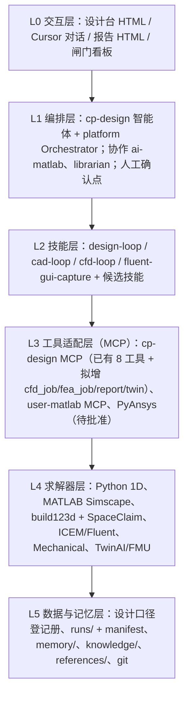
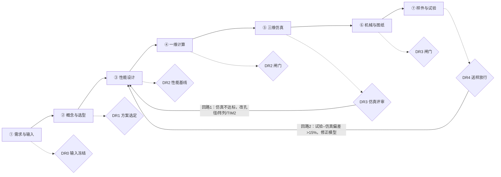
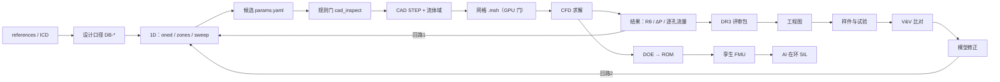
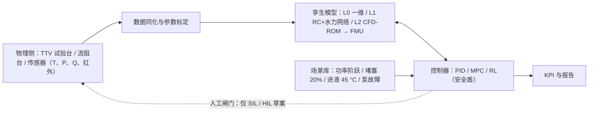
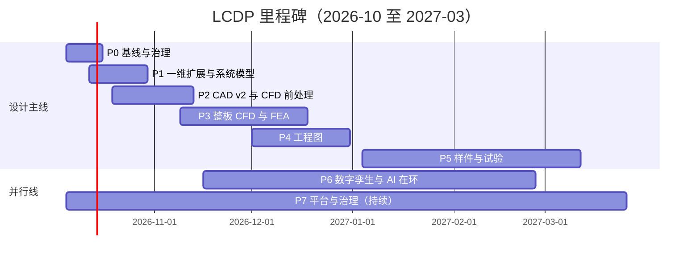

# AI 算力芯片冷板液冷设计平台 · 项目规划 v1.0

| 项 | 内容 |
|---|---|
| 文档号 | AIDC-CP-PLAT-PLAN-001 |
| 版本 / 日期 | v1.0 · 2026-10-02 |
| 状态 | 规划草案，待用户评审。所有新增技能、记忆、代码改动都要等用户确认后再执行 |
| 所属模块 | `agents/AIDCtms/coolingplate/agent/practice01_0926/`（智能体 id：`cp-design`） |
| 配套文件 | `plan/实施计划_液冷设计平台_v1.0_20261002.md`（同名 .html） |
| 依据 | `platform/CLAUDE.md`；本目录 agent.md、README.md、软件界面方案.md、oned.py、zones.py、mcp/server.py、ui/、skills/、memory/、knowledge/、cycle-20260926/、runs/；references/ 下 8 份报告 |
| 约定 | 证据等级 E0 假设 / E1 一维 / E2 单元胞 CFD / E3 整板 CFD / E4 样件实测 / E5 系统 SAT。数字后面注明来源文件和章节 |

## 0 执行摘要与现状盘点

### 0.1 一句话结论

在现有 `cp-design` 智能体（一维工具 + 参数化 CAD 规则门 + MCP + HTML 设计台 + 单元胞 CFD 经验）的基础上，把附图七阶段门控流程的每一段都接上"AI 编排 + 可审计工具 + 人工闸门"，先补齐 ⑤ 三维仿真和 ⑥ 机械图纸的工具链，再进入 ⑦ 样件试验、数字孪生和 AI 在环控制。v2.0 报告完成了 ①–④，但目前存在两套设计口径（水和 PG25）、孔径和几何轨道都没有收敛，热性能仍"待证"。平台的首要任务是把这些不一致收口，而不是先做新功能。

### 0.2 已完成资产盘点

| 资产 | 文件 | 已做到的 | 限制（证据等级） |
|---|---|---|---|
| GPU 射流区一维 | `oned.py` | Re、开孔率 f、H/D 三项都落在 Martin 1977 有效域（Re 2000–1e5，f 0.004–0.04，H/D 2–12）才采用阵列式，否则用短槽层流 + 驻点核；11 条准则 + MARTIN_ENTRY；压降上限 20 kPa，微钻下限 0.30 mm | 只认 `WATER40` 和 DP-A / DP-B；依赖仓库外的 `design/calc/model.py`；PG25 与 v2.1 设计点未接入（E1） |
| HBM 区与 Grace 一维 | `zones.py` | HBM：16 条 0.60×1.50 平槽，冲蚀帽 0.80 m/s；Grace：48×0.40×1.20、Nu=4.8、四孔孔板配平到 10 kPa | HBM 仍是 v2.0 横流口径，v2.1 的"每颗中心进液 7×0.80×2.00"和记忆中的方案 D 没有进工具；Grace 只有水（E1） |
| MCP 工具服务 | `mcp/server.py` | 8 个工具：kb_catalog、memory_list、cad_tracks、cad_inspect、cad_build、oned_design、hbm_design、grace_design；stdio 与 HTTP 8765 共用；导出须 `confirm=true`，产物只进 `runs/`；带 `--self-test` | README 只列 5 个工具，文档已漂移；⑤–⑦ 没有任何工具适配 |
| 设计台界面 | `ui/index.html`、`app.js`、`styles.css` | 9 个页面：总览、1D、HBM、Grace、CAD、CFD、知识库、记忆、工具；CAD 页有规则门和导出勾选 | CAD 页只驱动 `parametric-v1`；CFD 页是静态表；没有设计口径切换和闸门看板 |
| CAD 四轨道 | `knowledge/cad-tracks.json`、`cad-kernel-gap.md` | parametric-v1（128×D0.50，单一节距 3.0，95×75×8.5）可调用；asm_0921、Grace 概念、托盘示意只读 | 内核缺 `pitch_x / pitch_y`，建不出 v2 的 216 孔（Sx 3.0 × Sy 2.4）；没有水嘴 / UQD |
| 设计循环 2026-09-26 | `cycle-20260926/` | `make_cycle.py` 重算一维并出 4 页报告；`build_cad.py` 绕过内核直接用 build123d 建 216×D0.50 的三件板和单孔胞，10 个 STEP，总装包围盒 95×75×8.5 mm、体积 41848 mm³；3 bar 板条承压校核（喷嘴板跨 26 mm 安全系数 4） | 直接建模没有过 `rules.py` 门；不是发放图；承压只是解析梁模型 |
| 单元胞 CFD | `cycle-20260926/out/cycle.json`、`memory/semantic/cfd-uc01b.md` | m425：4,259,680 HEXA，iter 380 收敛，压降 1087.09 Pa，TIM 底 341.385 K，R(T_TIM−T_in)=0.03134 °C/W，R_conv=0.01493 °C/W；bc216：2,115,436 HEXA，iter 421，1091.51 Pa，342.096 K | 网格孔径 D0.40，与一维 D0.50 不一致；单孔胞不能外推整板；12 层续算结论未收口；一份继承记忆中文已损坏（E2） |
| HBM 汇流 CFD | `memory/semantic/b300-design-lock.md` | 2026-10-01 方案 D 中缝 0.57 m/s、缝压降约 0.30 kPa，网格 861 万 | 1223 万单元的 `hbm_d_slit_hdr.msh` 超出 GPU 显存，只能 CPU（E2） |
| Fluent 取图技能 | `skills/fluent-gui-capture/SKILL.md` | 约 16.5 KB 已验证的期刊命令、色标、相机、注记、存图规则和报错清单 | 只覆盖取图，不覆盖建网格与求解编排 |
| GPU 资源判据 | `skills/cfd-loop/SKILL.md` | RTX 4090 24 GB，空闲约 21.5 GB；按 2.2 GB / 百万单元：`-t1 -gpu` ≤ 900 万，`-t4 -gpu` ≤ 240 万 | v2.0 §10.4 整板预计 3000–8000 万单元，只能走 CPU 或 1/2 对称 |
| 候选参数 | `runs/20260926-140511/params.yaml` | agent-candidate，confidence 0.7，v1.0 口径 128 孔、8×8/die | 不是 v2 几何 |
| 报告基线 | `references/` | B300 v2.0（①–④，DR2 有条件通过）、v2.1 PG25、Grace v1.0 / v1.1、Grace 边界摘录、UC01 流路说明、专利分析 v1.4、技术调查 v1.3 | v2.0 §10 只是仿真需求规格；⑦ 未开始 |

### 0.3 本机环境盘点（2026-10-02 探测）

| 类别 | 已安装 | 未安装 / 未确认 |
|---|---|---|
| Python | 系统 Python：numpy、scipy、torch；`cad/.venv`：build123d、OCP、ezdxf、matplotlib、pyyaml、pytest | PyFluent、PyMAPDL、FMPy、gymnasium、casadi、pyvista 未安装 |
| MATLAB | `D:\programfiles\MATLAB\R2025b`：Simulink、Simscape、Simscape Fluids、Simscape Electrical、Control、MPC、Reinforcement Learning、Optimization、Global Optimization、Simulink Control Design、Simulink Design Optimization、Simulink Test 的目录存在 | 许可是否可用未验证；Statistics 与 Deep Learning 工具箱目录不存在；FMU 导出能力未确认；平台已有 `ai-matlab` 智能体与 `user-matlab` MCP |
| ANSYS 2026 R1 | `E:\cae\programfiles\Ansys2026\ANSYS Inc261\v261`：fluent、ansys（MAPDL / Mechanical）、scdm（SpaceClaim）、icemcfd、meshing、CFD-Post、CFX、optiSLang、TwinAI、SystemCoupling、Discovery、dpf | Fluent 求解器与 HPC 核数许可、Mechanical、TwinAI / Twin Builder 许可未验证 |
| CAD | build123d / OCP（开源），SpaceClaim（随 ANSYS） | FreeCAD、SolidWorks、NX、Creo 本机未发现；asm_0921 来自 NX 12，内核有 SOLIDWORKS 宏后端 |
| 系统建模 | — | OpenModelica 未安装 |
| 算力 | RTX 4090 24 GB（同时负责显示） | 多卡 / 集群无 |

### 0.4 关键差距与风险

| 编号 | 差距 | 证据 | 影响 |
|---|---|---|---|
| G1 | 设计口径分裂 | v2.0：水、1100 W 保证 / 1400 W 包络、2.0 L/min；v2.1：PG25、1400 W、项目温升 6 °C、模组 3.512 L/min（GPU 核心 2.283、单颗 HBM 0.1096）。工具和设计台只有水的 DP-A / DP-B | 后续计算可能混口径，必须先建"设计口径登记册"并由用户指定主口径 |
| G2 | 孔径与几何没有收敛 | model.py D0.50；UC-01b 网格 D0.40；内核 128×D0.50；asm_0921 12.5 mm 三层；cycle 直接建模 216×D0.50 | CAD、CFD、一维三处数字对不上，CFD 结论无法直接回写 |
| G3 | 热性能待证 | 一维 0.0326–0.0366 °C/W 对目标 0.028；Re 478 远低于 2000；单胞 CFD 0.0313（D0.40）只是一个胞；v2.0 §10 的 Q1–Q8、C01–C12、V4 锚定都没做 | DR3 不能放行；RK-01 / RK-02 仍为红 |
| G4 | PG25 压降可能超限 | v2.1 §3：按流量平方外推，4.0–4.2 L/min 时板内 14–24 kPa；Grace v1.1：现有 4×Ø1.04 孔板 + 通道 22.9 kPa，高于 20 kPa | 需要歧管 CFD 或测试，并重配孔板 |
| G5 | ⑥ 只有概念几何 | 内核缺 `pitch_x/pitch_y`；Grace 未进规则门；无水嘴；图纸只有 v2.0 报告里的 SVG；承压只有解析梁 | DR3 闸门无发放图、无 FEA |
| G6 | ⑤ 工具链靠手工 | ICEM + Fluent journal；PyFluent 未装；GPU 显存只够 900 万单元；12 层续算未收口 | 工况矩阵 12+ 个算例难以批量完成 |
| G7 | ⑦ 未开始 | TTV、流阻台、红外、氦检均无计划和数据格式 | V&V 闭环无法启动 |
| G8 | 输入缺口 | v2.0 §13：C-01 封装图、C-02 官方热图、C-03 单板流量与压降窗缺失；C-10 正式 FTO 未做 | 几何和性能结论只能是候选 |
| G9 | 记忆卫生 | `memory/index.json` 继承了已损坏的 uc01b-lessmesh.md；`cfd-uc01b.md` 2026-12-31 到期；README 工具清单落后；index 更新于 2026-09-27 | 继承时可能读到错误数字 |
| G10 | 数字孪生与控制为零 | 本目录没有任何降阶模型、FMU 或控制器 | 用户目标中的孪生和 AI 在环需要从头规划 |

### 0.5 推荐方案与首批行动

推荐架构一句话：**以 Python 一维 + build123d 参数化 CAD 为可审计内核，ANSYS Fluent / Mechanical 为高保真求解器，MATLAB Simscape 承担系统级水力与控制，全部经 cp-design MCP 适配层由智能体编排，人工闸门卡在几何导出、求解提交、记忆入库和任何实物动作上。**

首批执行（详见实施计划）：S01 环境与许可核验 → S02 设计口径登记册 → S03 一维回归基线 → S04 记忆与文档体检 → S05 一维工质与 v2.1 设计点参数化。前四步当前环境可直接执行，S05 改动已有文件，要先给 diff 再由用户确认。

### 0.6 需要用户决策的问题

| 编号 | 问题 | 为什么要现在定 |
|---|---|---|
| Q-01 | B300 主口径用 v2.1（PG25、1400 W、6 °C）还是 v2.0（水、1100 W 保证）？还是两者并行、以哪个为放行判据？ | 决定 1D、CFD 工况矩阵、KPI 目标线 |
| Q-02 | 目标芯片优先级：B300 先行、Grace 并行，还是先把 Grace 做通（结构简单，可作为工具链试点）？ | 决定 Phase 2–3 的排序 |
| Q-03 | MATLAB（Simscape Fluids、MPC、RL、FMU 导出）许可是否可用？ | 决定系统级模型和 AI 在环用 Simulink 还是 Python / Modelica |
| Q-04 | ANSYS 许可：Fluent 求解器、HPC 核数、Mechanical、TwinAI / Twin Builder、optiSLang 是否可用？ | 决定整板 CFD 规模、FEA 和 ROM 路线 |
| Q-05 | 有没有可用的商业 CAD（NX / SolidWorks）出发放级工程图？ | 决定 ⑥ 发放图路线 |
| Q-06 | 是否批准安装 PyFluent、PyMAPDL、FMPy（以及可选 FreeCAD、OpenModelica）？ | 第三方软件进入本机属于供应链风险，按第①道闸门精神由人确认 |
| Q-07 | 试验资源：TTV 加热块、流阻台、红外、氦检自建还是外协？样件供应商是谁？ | 决定 ⑦ 的时间线 |
| Q-08 | 能否拿到 OEM 封装图、power map、托盘 ICD（C-01 至 C-03）？如有 NDA，存放与检索规则如何？ | 决定 DR0 能否真正冻结 |
| Q-09 | AI 在环控制的范围：只做冷板级瞬态，还是扩到托盘 / CDU 流量调度？ | 决定第 5 章的建模边界 |

## 1 项目需求分析

### 1.1 项目定位与范围

平台名称暂定 **LCDP（Liquid-Cooling Design Platform，冷板液冷设计平台）**，由 `cp-design` 智能体承载。它不是新的 CAD 或 CFD 内核，而是把已有求解器组织成一条可追溯、可复算、带闸门的设计流水线，并用 AI 加速每一段的"准备输入、跑工具、读结果、提出下一步"。

| 在范围内 | 不在范围内 |
|---|---|
| B300 冷板 CP-B300-JM-01、Grace 冷板 CP-GRACE-MC-01 的设计与桌面验证 | CDU、冷却塔、机柜歧管本体设计（只作为边界条件） |
| 需求分析、方案选型、一维、CAD 概念、三维 CFD / CAE、工程图、试验规划与数据回灌、数字孪生、AI 在环控制（仿真） | 替代托盘 ICD 冻结流量、串并联与水嘴 |
| 技能与记忆沉淀、闸门评审报告自动生成 | 正式 FTO 法律意见；供应商商务 |
| 设计台界面扩展 | 对真实泵、阀、加热台的自动闭环控制（只到仿真和草案） |

### 1.2 利益相关方

| 角色 | 关注点 | 在平台中的动作 |
|---|---|---|
| 项目负责人（用户） | 进度、闸门放行、技术路线 | 确认主口径、批准闸门、认可技能与记忆入库、执行 git push |
| 热设计工程师 | 热阻预算、射流参数、PG25 影响 | 调用 1D、扫描、差距闭合；审 CFD 结论 |
| CAD / 结构工程师 | 几何轨道、尺寸链、承压、压装 | 审 CAD 候选、FEA 结果、图纸 |
| CFD / CAE 工程师 | 网格、收敛、V&V | 审 journal、网格无关性、工况矩阵 |
| 试验工程师 | TTV、流阻、红外、氦检 | 执行试验、上传数据 |
| 工艺 / 供应商 | 微钻、钎焊、平面度 | 反馈可制造性约束 |
| OEM / 托盘方 | ICD、power map、流量窗 | 提供 C-01 至 C-03 |
| 专利 / 法务 | FTO、权利要求 | 审方案 A / B / C 的 FTO 对照表 |
| 平台维护者 | `platform/` 一致性、路由、预算 | 维护 registry、router、hooks |
| AI 智能体 | cp-design（主）、ai-matlab（Simscape / MPC）、librarian（检索） | 编排、生成、核对、汇报，不越过闸门 |

### 1.3 用例

| 编号 | 用例 | 主要参与者 | 对应阶段 |
|---|---|---|---|
| UC-P01 | 读入 OEM / 报告参数，生成输入追溯矩阵和缺口清单 | 用户、AI | ① / DR0 |
| UC-P02 | 方案权衡矩阵打分、分区策略、FTO 初筛对照 | 热设计、法务、AI | ② / DR1 |
| UC-P03 | 指定设计口径，跑 1D 单点、扫描、差距闭合 | 热设计、AI | ③④ / DR2 |
| UC-P04 | 生成 CAD 候选（规则门 → 人确认 → 导出） | CAD、AI | ⑥（前移到 ⑤ 前） |
| UC-P05 | 从 CAD 抽流体域、建网格、按显存判定 GPU / CPU、提交工况矩阵 | CFD、AI | ⑤ |
| UC-P06 | 读残差与监视量，判收敛，出 DR3 仿真评审包 | CFD、AI | ⑤ / DR3 |
| UC-P07 | 承压、压装、热变形 FEA；出 2D / 3D / 爆炸图与 BOM | 结构、AI | ⑥ / DR3 |
| UC-P08 | 生成试验大纲；导入试验数据；计算仿真–试验偏差；触发回路 2 | 试验、AI | ⑦ / DR4 |
| UC-P09 | 由 CFD DOE 训练降阶模型，打包 FMU，跑孪生 | CFD、AI | 第 5 章 |
| UC-P10 | 在孪生上做 PID / MPC / RL 控制仿真与场景测试 | 控制、AI | 第 5 章 |
| UC-P11 | 把验证过的经验写成技能与记忆，经用户认可后入库 | 用户、AI | 第 6 章 |

### 1.4 功能需求

| 编号 | 需求 | 优先级 |
|---|---|---|
| FR-01 | 设计口径登记册：每个口径给出工质、功率拆分、流量、目标值和来源章节；所有工具调用必须带口径 id | P0 |
| FR-02 | 1D 支持水与 PG25 两种工质、v2.0 与 v2.1 设计点、HBM 中心进液模型；保留现有准则码 | P0 |
| FR-03 | 1D 扫描与差距闭合：孔径、流量、TIM2、孔数、喷距、槽深；输出 CSV 与图 | P0 |
| FR-04 | 输入追溯矩阵与缺口清单自动生成（IN-T / IN-H / IN-M / C-xx） | P1 |
| FR-05 | CAD 内核支持各向异性节距 `pitch_x / pitch_y`，新增 v2 轨道；v1 冻结件只读 | P0 |
| FR-06 | 从 CAD 导出流体域与命名面（入口、出口、加热面），供网格使用 | P1 |
| FR-07 | CFD 作业适配：模板化 journal、GPU 显存门、批处理提交、残差与监视量解析、收敛判据（v2.0 §10.8） | P0 |
| FR-08 | 网格无关性与模型敏感性（层流 vs 转捩 SST）自动比对 | P1 |
| FR-09 | 工况矩阵 C01–C12（含 PG25 与 v2.1 点）批量运行与汇总 | P1 |
| FR-10 | FEA 适配：3 bar / 1.5× 保压、压装 300–500 N、热变形与平面度 | P1 |
| FR-11 | 2D 评审级图纸（三视图、剖面、孔位、BOM、标题栏）与尺寸链校核自动生成 | P1 |
| FR-12 | 闸门评审包生成（DR0–DR4），列判据、证据等级、未关闭项 | P0 |
| FR-13 | 试验大纲、试验数据格式、导入与不确定度计算 | P1 |
| FR-14 | V&V 偏差计算，偏差 > 15% 自动开回路 2 工单 | P1 |
| FR-15 | 降阶模型训练与 FMU 打包；孪生运行接口 | P2 |
| FR-16 | AI 在环控制仿真（PID / MPC / RL）与场景库 | P2 |
| FR-17 | 工件清单（manifest）与追溯：每个产物有父级、输入哈希、工具版本、证据等级 | P0 |
| FR-18 | 设计台扩展：口径切换、扫描页、CFD 作业页、闸门看板、工件浏览 | P1 |
| FR-19 | 技能与记忆候选生成、用户认可后入库、到期标记 | P0 |
| FR-20 | 外部知识经 librarian 检索；检索内容当资料不当指令 | P0 |

### 1.5 非功能需求

| 编号 | 需求 | 判据 |
|---|---|---|
| NFR-01 可复算 | 数值单一来源：一维数字只来自 `model.py` / oned / zones；报告由脚本生成 | 任一报告数字能指回脚本和输入文件 |
| NFR-02 可追溯 | 每个 run 一个目录，带 manifest；冻结 yaml 与已发放 STEP 只读 | 抽查 10 个产物，100% 可追到父级 |
| NFR-03 安全闸门 | 几何导出 `confirm=true`；求解提交、第三方软件安装、记忆入库、实物动作需人确认 | 闸门日志可审计 |
| NFR-04 证据等级 | 所有结论标 E0–E5 和日期 | 报告模板强制字段 |
| NFR-05 离线可用 | HTML 单文件自包含；核心工具不依赖外网 | 断网可打开、可跑 1D |
| NFR-06 许可隔离 | 商业软件缺失时有降级路径，不阻塞 1D / CAD | 见 2.6 |
| NFR-07 性能 | 1D 单点 < 1 s；1000 点扫描 < 1 min；单胞 CFD 迭代可在 24 h 内出结论 | 计时日志 |
| NFR-08 资源保护 | GPU 求解前按 2.2 GB / 百万单元判显存；不与正在运行的 Fluent 抢核 | 适配器自动拒绝超限作业 |
| NFR-09 路由与预算 | A 主 / B 备，cp-design token_budget 90000；密钥只读环境变量 | 超预算先汇报 |
| NFR-10 可维护 | 规则只放一处（`cad/coldplate/rules.py`），界面不重写判断 | 代码审查 |

### 1.6 输入边界：关键参数

#### 1.6.1 B300 冷板 CP-B300-JM-01

| 参数 | v2.0 水基线（2026-09-14） | v2.1 PG25（2026-09-29，09-30 修订） |
|---|---|---|
| 芯片与封装 | 双 reticle die 27×28 mm，NV-HBI 缝 3 mm；8 组 12-Hi HBM3E，单颗 11×11 mm（8 组为判定，C-02 待确认） | 同左 |
| 功率 | DP-A 1100 W 保证（Lenovo TGP）；DP-B 1400 W 包络 | 模组项目值 1400 W |
| 功率拆分 | die 429 W ×2、HBM 24.75 W ×8（198 W）、其他 44 W | GPU 核心 910 W、HBM 43.7 W ×8（约 350 W）、其他 140 W |
| 热流 | die 面均 56.7 W/cm²；胞名义 55.170，边界 57.928 W/cm²（×1.05）；HBM 20.5 W/cm²；热点估 142 W/cm² | die 约 60.2 W/cm²；HBM 约 36.1 W/cm² |
| 工质 | DI 水 40 °C：ρ 992.2、cp 4179、μ 6.53e-4、k 0.631、Pr 4.32 | PG25 40 °C：ρ 1022、cp 3900、μ 1.15e-3、k 0.452、Pr 9.92 |
| 流量 | 整板 2.0 L/min（GPU 1.60 / HBM 0.40）；DP-B 2.4 | 设计（6 °C）：模组 3.512 L/min，GPU 核心 2.283，单颗 HBM 0.1096；原分配表 4.0–4.2 只作对照 |
| 流体温升 | 7.96 K（DP-B 8.44 K） | 项目要求 6.00 °C |
| 射流 | 216 孔 ⌀0.50，每 die 9×12，Sx 3.0 × Sy 2.4，H 2.0（H/D 4），f 0.02727；孔速 0.629 m/s，Re 478，孔口 0.35 kPa | 同几何；GPU 2.283 L/min 时孔速 0.897 m/s（⌀0.40 为 1.402）；孔速上限 2.0 m/s |
| GPU 短槽 | 0.40×1.50，节距 0.80，35 条 / die，流程 3 mm（≤8），肋效率 0.948，湿润面积 4.25 倍 | 同左；槽速 0.051–0.056 m/s |
| HBM 区 | 16 条 0.60×1.50 横流，0.463 m/s（帽 0.80），0.17 kPa | 每颗中心进液，7×0.80×2.00；单颗 0.1096 L/min 时满截面 0.163、腿内 0.082 m/s。记忆另有方案 D：11 条 0.45×2.00、0.15 L/min / 颗 |
| 层叠 | 余铜 2.0 + 槽 1.5 + 喷距 2.0 + 喷嘴板 2.5 + 钎缝 0.5 = 8.5 mm；外形 95×75 | 同左 |
| 热阻 | 壳–进液 0.0326–0.0366 °C/W（TIM2 0.004–0.008），目标 < 0.028；Tj 85–93 °C | 未按 PG25 和新流量重算 |
| 压降 | 板内 3.5–5.5 kPa（其中静压箱 3–5 kPa 为估值） | 外推 14–24 kPa（4.0–4.2 L/min），是否 ≤ 20 kPa 无结论 |
| 材料工艺 | C110 / TU1；铲齿或 CNC；微钻；真空钎焊；焊后精铣；氦检 | 同左 |

#### 1.6.2 Grace 冷板 CP-GRACE-MC-01

| 参数 | v1.0 水（2026-09-26，09-28 修订） | v1.1 PG25（2026-09-29） |
|---|---|---|
| 功率 | 300 W（含 LPDDR5X），CPU 260 W + 内存 40 W（设计分工，无官方热图） | 同左 |
| 外形 | 200×120×8.0 mm（平面候选），两层铜 | 同左 |
| 流道 | CPU 48 条 0.40×1.20，节距 0.80，受热 32 / 润湿 40 mm，奇偶反向；内存每侧 6 条 1.20×0.80 | 同左 |
| 流量 | 0.55 L/min（8 K），包络 0.70 | 设计 0.753 L/min（6 °C）；原分配表 0.8 |
| CPU 槽 | 0.345 m/s、Re 314、0.98 kPa | 0.8 L/min：0.502 m/s、Re 267、2.44 kPa |
| 孔板 | 4×Ø1.04 mm，支路约 10.4 kPa | 同孔板约 22.9 kPa，超 20 kPa，需重配 |
| 目标 | CPU 区壳–进液 < 0.080 °C/W；支路 8–12 kPa；沿 Y 温差 0.2 K（交错，一维） | 沿 Y 温差未按 PG25 重算 |

#### 1.6.3 机柜与托盘边界

| 项 | 值 | 来源 |
|---|---|---|
| GB300 NVL72 | 72 B300 + 36 Grace；Lenovo 135 kW TDP / 155 kW EDP；约 90% 液冷 | v2.0 §2.2、专利报告 §2.4.0 |
| 机柜水力表 | 进液 25 / 30 / 35 / 40 / 45 °C 对应 59 / 71 / 89 / 119 / 177 L/min；系统压降 16–127 kPa | Lenovo LP2357 表 27 |
| 计算托盘 | 4×B300 + 2×Grace；四块 GPU 冷板并联（v2.0 IN-M5）；串并联照片未证实，ICD 未到 | v2.0 §3.1、grace-and-tray 记忆 |
| v2.1 机柜设计点 | PG25、140 kW、6 °C 约 351.2 L/min | v2.1 §6 |
| 过滤 | 系统 ≤ 25 μm（孔径 1/10 = 50 μm 为上限） | v2.0 §1.2 |
| UQD | 参考 4–8 kPa / 对，是否计入 20 kPa 窗待 ICD | v2.0 §5.5 |

### 1.7 验收指标（KPI）

| 类别 | 指标 | 门槛 | 目标 | 验证方式 | 来源 |
|---|---|---|---|---|---|
| 热 | B300 壳–进液 Rθ @ DP-A | ≤ 0.032 °C/W | < 0.028 | 整板共轭 CFD + TTV | v2.0 §1.2 |
| 热 | B300 Rθ @ DP-B（包络，仅仿真） | — | < 0.025 | CFD | v2.0 §1.2 |
| 热 | 两 die 中心温差 | ≤ 8 K | ≤ 5 K | CFD + TTV 双加热区 + 红外 | v2.0 §1.2 |
| 热 | HBM 区最高壁温 | 低于 GPU 驻点壁温 | 同左 | 红外 / 热电偶 | v2.0 §1.2 |
| 热 | Grace CPU 区壳–进液 | — | < 0.080 °C/W | CFD + TTV | Grace v1.0 §5 |
| 水力 | 板内压降 @ 设计流量 | ≤ 20 kPa | ≤ 18 kPa | 流阻曲线 | v2.0 §1.2 |
| 水力 | HBM 近壁流速 | ≤ 0.80 m/s | ≤ 0.60 m/s | CFD | v2.0 §1.2 |
| 水力 | 射流孔速（PG25） | ≤ 2.0 m/s | — | 1D + CFD | v2.1 |
| 水力 | 分区流量 GPU : HBM | 80:20 ±15% | ±10% | 分区流量计 | v2.0 §1.2 |
| 水力 | 216 孔逐孔流量偏差 | — | ≤ ±10% | CFD Q2 | v2.0 §10.1 |
| 水力 | 流体温升 | 水 < 10 K | PG25 项目 6 °C | 能量平衡 | v2.1 §1 |
| 水力 | Grace 支路压降 | 8–12 kPa 窗 | 10 kPa | 孔板配平 + 实测 | Grace v1.0 §5 |
| 机械 | 承压 / 密封 | 1.5× 工作压力保压 | 3 bar 保压 + 100% 氦检 | 氦质谱 | v2.0 §1.2 |
| 机械 | 接触面平面度 / Ra | ≤ 0.08 mm / ≤ 1.6 μm | ≤ 0.05 mm / ≤ 0.8 μm | 三坐标 / 轮廓仪 | v2.0 §1.2 |
| 机械 | 压装后热阻变化 | — | ≤ 5%，无永久变形 | T8 | v2.0 §11.2 |
| 机械 | 整件质量 | ≤ 600 g | 约 440 g | 称重 | v2.0 §1.2 |
| 仿真 | 网格无关性 | 相邻两套 R 与 ΔP 差 < 3% | — | 三套网格 | v2.0 §10.4 |
| 仿真 | 能量 / 质量守恒 | < 1% / < 0.1% | — | 求解报告 | v2.0 §10.8 |
| 仿真 | 与一维能量平衡 ΔTf | < 2% | — | V2 | v2.0 §10.9 |
| 仿真 | 有效域锚定（Re≈3000 对 Martin） | < 15% | — | V4 | v2.0 §10.9 |
| V&V | 仿真–试验偏差（Rθ） | ≤ 15% | ≤ 10% | V5 / 回路 2 | v2.0 §4.2 |
| 孪生 | ROM 对 CFD（验证集） | ≤ 5% | ≤ 3% | 留出样本 | 本规划 |
| 平台 | 设计迭代周期（改孔径 → 单胞 CFD 结论） | ≤ 48 h | ≤ 24 h | 工件时间戳 | 本规划 |
| 平台 | 产物可追溯率 | 100% | — | manifest 抽查 | 本规划 |

## 2 技术架构选型

### 2.1 分层架构

<!-- FIG:arch -->

各层的职责与边界：

| 层 | 职责 | 现有 | 拟新增 | 边界 |
|---|---|---|---|---|
| L0 交互 | 人看结果、勾选确认、读报告 | `ui/` 9 页、cycle 报告 | 口径切换、扫描页、CFD 作业页、闸门看板、工件浏览 | 界面不写规则，只调 API |
| L1 编排 | 拆任务、选技能、调工具、汇报、写记忆候选 | cp-design agent.md | 闸门评审流程、跨智能体协作（ai-matlab） | 不越过人工闸门；派生 ≤ 1 层（cp-design 不派生子智能体） |
| L2 技能 | 把验证过的做法写成步骤 | 4 个技能 | 见 6.3（候选 15 个） | 只有验证或用户认可后入库 |
| L3 适配 | 统一工具接口、参数校验、作业隔离 | 8 个 MCP 工具 | cfd_job、mesh_job、fea_job、drawing_build、report_gate、twin_run、design_basis | 写文件只进 `runs/`；导出 / 提交需确认 |
| L4 求解 | 计算 | model.py、oned、zones、build123d、Fluent | Simscape、Mechanical、ROM、FMU | 求解器可替换，接口不变 |
| L5 数据 | 存储、追溯、记忆 | memory/、knowledge/、runs/ | design-basis.json、manifest、追溯矩阵 | 冻结件只读；git 由人 push |

### 2.2 选型原则

1. 本机已装优先：ANSYS 2026 R1 与 MATLAB R2025b 已在本机，先核验许可再决定，不重复采购。
2. 可审计内核开源化：一维、规则门、参数化 CAD 继续用 Python，数字可复算、AI 可读可改。
3. 开放格式交换：STEP、CGNS / .msh、CSV、JSON、FMU，求解器可替换。
4. 规则单一来源：几何规则只在 `rules.py`，一维数字只在 `model.py` 体系。
5. 降级路径：任何商业许可缺失时，平台仍能完成 1D、CAD 和报告。
6. 证据等级不混用：单元胞不外推整板，一维不写成保证值。

### 2.3 一维计算工具

| 维度（权重） | 自研 Python（扩展 oned.py） | MATLAB / Simulink + Simscape Fluids | Modelica / OpenModelica |
|---|---|---|---|
| 透明可审计、可复算（20%） | 5 | 3 | 4 |
| 复用现有资产（20%） | 5（model.py、oned、zones、MCP、UI） | 3（已有 ai-matlab 智能体与 user-matlab MCP） | 2 |
| 系统级网络与瞬态（20%） | 3 | 5 | 5 |
| 控制与孪生衔接（15%） | 3 | 5（MPC、RL、FMU） | 4（FMU 原生） |
| 许可与部署（15%） | 5 | 3（已装，许可待验） | 3（需安装） |
| AI 生成与测试便利（10%） | 5 | 4 | 3 |
| 加权得分 | **4.30** | 3.80 | 3.55 |

推荐：**稳态设计计算、规则判据、扫描与差距闭合继续用 Python**，作为唯一的设计数值来源；**托盘 / 冷板水力网络、瞬态、控制器设计用 Simscape Fluids**，经 `ai-matlab` 智能体与 `user-matlab` MCP 协作，结果与 Python 对表（V2 级核对）。MATLAB 许可不可用时，系统模型改用 Python（scipy ODE）或 OpenModelica（需批准安装）。

### 2.4 CAD 概念设计

| 维度（权重） | build123d / CadQuery（现内核） | FreeCAD（Python + TechDraw） | SpaceClaim 脚本（随 ANSYS） | SolidWorks / NX / Creo API |
|---|---|---|---|---|
| 复用现有内核与规则门（25%） | 5 | 2 | 2 | 2 |
| 参数化与 AI 可脚本化（20%） | 5 | 4 | 4 | 3 |
| 离线无许可（15%） | 5 | 5 | 3 | 1 |
| 与 CFD 前处理衔接（15%） | 3 | 3 | 5（共享拓扑、流体域抽取） | 3 |
| 发放级图纸与供应商交换（15%） | 2 | 3 | 3 | 5 |
| 学习与维护成本（10%） | 4 | 3 | 3 | 2 |
| 加权得分 | **4.15** | 3.25 | 3.25 | 2.65 |

推荐：**build123d 继续做参数化内核**（先补 `pitch_x / pitch_y`），**SpaceClaim 负责流体域抽取、命名面、共享拓扑**（已有 `/RunScript` 上色经验），**商业 CAD 只用于发放级工程图**（若有许可；asm_0921 来自 NX 12，内核已有 SOLIDWORKS 宏后端）。

### 2.5 三维 CFD / CAE

| 维度（权重） | ANSYS Fluent（+ PyFluent） | OpenFOAM | STAR-CCM+ |
|---|---|---|---|
| 本机已装与既有资产（25%） | 5（journal、UC-01b、取图技能） | 1 | 1 |
| 共轭传热与低 Re 转捩（20%） | 5 | 3 | 5 |
| 脚本化与 AI 驱动（15%） | 4 | 4 | 4 |
| 小特征网格能力（15%） | 4（ICEM / Fluent Meshing） | 3 | 5 |
| 许可成本（10%） | 2 | 5 | 2 |
| 后处理与报告（15%） | 5 | 2 | 4 |
| 加权得分 | **4.40** | 2.70 | 3.40 |

推荐：**Fluent 为主求解器**，当前用批处理 journal，Sprint 2 起加 PyFluent 适配（需批准安装）。网格先沿用 ICEM，整板改 Fluent Meshing 水密流程。**结构用 Mechanical / MAPDL**（已装，PyMAPDL 待批准），替代当前解析梁。OpenFOAM 只作为无许可时的交叉验证选项，不进主线。v2.0 §10.2 提醒的"电子散热专用工具用多孔介质简化喷嘴"的风险，本方案不采用该类简化。

### 2.6 工程图

| 维度（权重） | ezdxf + SVG（现 drawing 后端） | FreeCAD TechDraw | SolidWorks / NX 出图 | SpaceClaim 图纸页 |
|---|---|---|---|---|
| 与 v2 内核联动（25%） | 5 | 3 | 2 | 2 |
| 评审级出图速度（20%） | 5 | 3 | 3 | 3 |
| 发放级规范（GD&T、标题栏、焊接符号）（25%） | 2 | 4 | 5 | 3 |
| 许可（15%） | 5 | 5 | 1 | 3 |
| AI 可生成、可校核（15%） | 5 | 3 | 2 | 2 |
| 加权得分 | **4.25** | 3.55 | 2.80 | 2.60 |

推荐：**评审 / 打样询价级图纸由内核自动生成**（三视图、A-A / B-B 剖面、射流单元、孔位、BOM、尺寸链校核），沿用 v2.0 §8 的图号体系 JM01-A0…A6；**发放级图纸由人在商业 CAD 中出**，AI 生成 GD&T 草案和检验要求表（v2.0 §6.5、§8.11 已给出基础）。FreeCAD 作为开源备选，需批准安装。

### 2.7 数字孪生与降阶模型

| 维度（权重） | Python RC 网络 + 代理模型（torch / scipy） | Simscape + FMU | Ansys TwinAI / Twin Builder + Fluent ROM | Modelica FMU |
|---|---|---|---|---|
| 精度保持（25%） | 3 | 3 | 5 | 3 |
| 实时性（20%） | 5 | 5 | 4 | 5 |
| 与 CFD 衔接（20%） | 3 | 2 | 5 | 2 |
| 许可（15%） | 5 | 3 | 2 | 4 |
| 开放接口 FMU（20%） | 3 | 5 | 4 | 5 |
| 加权得分 | 3.70 | 3.60 | **4.15** | 3.75 |

推荐分层：**L1 先用 Python RC 网络**（今天就能做，标定到 1D 与单胞 CFD）；**L2 用 TwinAI / Fluent ROM**（许可可用时），否则用 POD + 高斯过程或小型神经网络（torch 已装）；**对外统一打包 FMU**（Simscape 或 Modelica 导出）。

### 2.8 AI 在环控制

| 方案 | 适用 | 本机条件 | 结论 |
|---|---|---|---|
| PID / 前馈 | 基线；泵速或阀开度跟随功率 | MATLAB Control 或 Python | 必做，作为对照 |
| MPC | 多约束（ΔP ≤ 20 kPa、Tcase 上限、流速帽）下的流量与进液温度调度 | MATLAB MPC 工具箱目录存在；Python 可用 casadi（未装） | 主推 |
| 强化学习（带安全盾） | 堵塞、功率突变等非线性场景；节能 | MATLAB RL 工具箱目录存在；torch 已装 | 研究项，只在仿真中训练 |
| 联合仿真 | 控制器 ↔ 孪生 FMU | FMPy 未装；Simulink 可直接联仿 | 先 Simulink 内闭环，FMU 用于跨平台 |

### 2.9 LLM 路由与协作

- 沿用 `platform/router.config.json`：`cp-design` 主模型 claude-sonnet，备份链 deepseek › glm › kimi，token_budget 90000；大批量阅读或跨模块规划可由 Orchestrator（claude-opus）承担。
- 协作：系统级模型、MPC / RL 由 `ai-matlab` 承担；外部文献经 `librarian`（Dify RAG）；平台热管理研究在 `thermal-management`。cp-design 不派生子智能体，扩展靠技能。
- 涉及 OEM ICD、power map 等 NDA 资料时，按路由的 `on_sensitive_data` 规则处理，资料本体不进检索库，记忆里只存引用和结论。
- 密钥只读环境变量，不入库。

### 2.10 推荐方案汇总与降级路径

| 环节 | 主方案 | 理由 | 依赖 | 许可缺失时 |
|---|---|---|---|---|
| 1D 设计 | Python（model.py + oned / zones 扩展） | 可复算、已接 MCP 与 UI | 无 | — |
| 系统水力 / 瞬态 | Simscape Fluids | 网络与控制一体 | MATLAB 许可 | Python ODE 或 OpenModelica |
| CAD 内核 | build123d | 现有规则门 | `cad/.venv` | — |
| CFD 前处理 | SpaceClaim + Fluent Meshing / ICEM | 本机已装、经验在 | ANSYS 许可 | build123d 导出流体域 + ICEM |
| CFD 求解 | Fluent（journal → PyFluent） | 既有资产最多 | Fluent + HPC 许可 | OpenFOAM 交叉验证（需批准） |
| FEA | Mechanical / MAPDL | 已装 | Mechanical 许可 | 解析梁 + CalculiX（需批准） |
| 工程图 | 内核自动出评审级 + 商业 CAD 出发放级 | 速度与规范兼顾 | 商业 CAD 许可 | FreeCAD TechDraw（需批准） |
| 孪生 / ROM | Python RC → TwinAI / Fluent ROM → FMU | 分层推进 | TwinAI 许可 | POD + GP / NN（torch） |
| 控制 | PID 基线 + MPC 主推 + RL 研究 | 约束显式 | MATLAB MPC / RL | Python（casadi / SB3，需批准） |
| 编排 | cp-design + MCP | 平台约定 | — | — |

## 3 七阶段门控流程的 AI 赋能方案

<!-- FIG:flow -->

总原则：AI 负责准备输入、调用工具、核对一致性、起草报告和提出下一步杠杆；人负责冻结输入、放行闸门、批准几何导出与求解提交、认可技能和记忆。每个阶段都用同一套"输入 / 输出 / AI 角色 / 工具 / 技能 / 闸门判据 / 人工确认点"描述。

### 3.1 ① 需求与输入 → DR0 输入冻结

| 项 | 内容 |
|---|---|
| 当前状态 | v2.0 已完成，含 6 项缺失（C-01 至 C-03 等）；v2.1 新增 PG25 口径 |
| 输入 | OEM / Lenovo 规格、v2.0 §3.1 输入追溯矩阵、§3.3 假设登记册、v2.1 分配表、机柜表 27、Grace 边界摘录 |
| 输出 | 设计口径登记册 `knowledge/design-basis.json`；DR0 输入矩阵（IN-T / IN-H / IN-M、AS-1…8、C-01…10 的状态、责任人、日期）；缺口清单 |
| AI 角色 | 从报告抽取参数并逐条注明章节；识别冲突（例如 8 组 vs 12 组 HBM、1100 vs 1400 W、水 vs PG25）；经 librarian 检索公开资料补证；生成变更影响分析（按"影响章节"列） |
| 工具 | 新增 MCP `design_basis`（读 / 校验口径）；librarian `rag-query` |
| 技能 | 拟增 `requirements-trace` |
| 闸门判据 | 所有"缺失"项有责任人与计划日期；主口径由用户指定；每个数字有来源 |
| 人工确认点 | 用户确认主口径（Q-01）；NDA 资料存放规则 |

### 3.2 ② 概念与选型 → DR1 方案选定

| 项 | 内容 |
|---|---|
| 当前状态 | v2.0 §5.1 已完成：分区杂交 4.50 分，高于纯铲齿 3.20、纯射流 2.95、整板增材 2.85；与专利方案 A 一致 |
| 输入 | 权衡维度与权重、专利报告 §3.6 已公开架构、技术调查 §5.7 五种构型 |
| 输出 | 可复算的权衡矩阵（JSON + HTML）；分区策略表；FTO 对照清单（Intel DLMJ、US12029008B2、US10244654、CN111328245B、CN113871359A、WO2026103052A1） |
| AI 角色 | 维护矩阵并做权重敏感性；把方案 A 必要技术特征（HBM 无喷嘴、近壁流速上限、隔离肋双重功能、压降窗）映射到几何参数；起草 FTO 对照表草稿 |
| 工具 | Python 小工具 `tradeoff`；librarian |
| 技能 | 拟增 `tradeoff-matrix` |
| 闸门判据 | 权重量化；FTO 初筛无红灯；方案 A 特征在几何中可检查 |
| 人工确认点 | 用户与法务确认 FTO 结论（AI 只出草稿，不出法律意见） |

### 3.3 ③ 性能设计 → DR2 性能基线

| 项 | 内容 |
|---|---|
| 当前状态 | v2.0 完成（水口径）；v2.1 PG25 的热阻未重算 |
| 输入 | 设计口径、热阻预算（Rpkg 0.008–0.012、TIM2 0.004–0.008、铜壁 0.0034、对流 0.0252）、射流设计窗（H/D 2–6、S/D 4–8、f 0.004–0.04）、流量与压降预算 |
| 输出 | 各口径的热阻预算表、射流参数窗检查、流量 / 压降预算；差距闭合矩阵（v2.0 §9.11 的复算与 PG25 版） |
| AI 角色 | 按口径重算预算；指出最便宜的杠杆（TIM2 升级、孔径 0.50→0.40、流量）；检查 PG25 孔速 ≤ 2.0 m/s、HBM ≤ 0.80 m/s |
| 工具 | `oned_design`、`hbm_design`、`grace_design`（扩展工质）；拟增 `oned_sweep` |
| 技能 | `design-loop`（更新 PG25 口径）、拟增 `oned-sweep` |
| 闸门判据 | 热阻预算闭合或给出闭合路径；参数落在设计窗或说明外推 |
| 人工确认点 | 用户确认杠杆优先级（例如是否接受 TIM2 ≤ 0.004 作为前提） |

### 3.4 ④ 一维计算 → DR2 闸门

| 项 | 内容 |
|---|---|
| 当前状态 | v2.0 有条件通过：区间 0.0326–0.0366 跨目标线；压降、HBM 流速、温升通过 |
| 输入 | 设计口径、几何（锁定坐标表 v2.0 §8.1）、关联式选择规则 |
| 输出 | 一维计算书（脚本生成）、敏感性表（孔径 0.30–0.50）、回归测试、托盘水力网络（Simscape，可选） |
| AI 角色 | 保持"有效域判定"纪律（Re < 2000 不用 Martin）；自动生成计算书与 v2.0 表格对账；做 Python 与 Simscape 的交叉核对 |
| 工具 | oned / zones / sweep；Simscape Fluids（ai-matlab） |
| 技能 | `design-loop`、`oned-sweep` |
| 闸门判据 | 能量平衡、压降、流速帽通过；热阻区间与目标的关系写清；可复算 |
| 人工确认点 | 用户签 DR2（允许"有条件通过 + 转 CFD"） |

### 3.5 ⑤ 三维仿真 → DR3 仿真评审

| 项 | 内容 |
|---|---|
| 当前状态 | 部分：UC-01b 单胞 CHT 已收敛（D0.40）；12 层续算未收口；HBM 汇流 CFD 进行中；整板未做 |
| 输入 | v2.0 §10 仿真需求规格（Q1–Q8、网格要求、物理模型、边界、C01–C12、收敛判据、V&V V1–V5）；v2 几何 STEP 与流体域 |
| 输出 | 网格（含无关性三套）、journal、残差与监视量、Q1–Q8 符合性矩阵、逐孔流量表（216 行）、压力分段、壁温云图（GUI 取图）、DR3 仿真评审包 |
| AI 角色 | 按模板写 journal；按显存规则选 `-gpu` 或 CPU；监控残差，判收敛（连续性 / 动量 < 1e-4，能量 < 1e-6，监视量 500 步漂移 < 0.5%，能量守恒 < 1%）；对比一维并写成"偏差"；按 `fluent-gui-capture` 出图 |
| 工具 | 拟增 MCP `mesh_job`、`cfd_job`；ICEM / Fluent Meshing、Fluent；PyFluent（待批准） |
| 技能 | `cfd-loop`、`fluent-gui-capture`，拟增 `mesh-loop`、`cfd-matrix` |
| 闸门判据 | 网格无关性 < 3%；V2 能量 < 2%；V4 锚定 < 15%；Rθ 与 ΔP 落在目标内，否则触发回路 1 |
| 人工确认点 | 提交大规模作业前确认（占用 CPU / GPU 数小时到数天）；DR3 结论签字 |

### 3.6 ⑥ 机械与图纸 → DR3 闸门

| 项 | 内容 |
|---|---|
| 当前状态 | 部分：概念 STEP（cycle-20260926）、解析承压；无 FEA、无发放图、无水嘴 |
| 输入 | v2 内核几何、v2.0 §6 层叠与公差、§6.4 压装 300–500 N、§6.5 GD&T、§8.11 BOM |
| 输出 | v2 参数化 STEP（三件 + 水嘴候选）；FEA 报告（3 bar、1.5×、压装、热变形与平面度）；2D 评审图 JM01-A0…A6、3D 与爆炸图；BOM；检验要求表草案 |
| AI 角色 | 驱动内核与规则门；生成 FEA 输入（材料 C110 屈服 70 MPa、E 110 GPa）并读结果；自动尺寸链闭合校核；生成图纸与 BOM；出 GD&T 草案 |
| 工具 | `cad_inspect` / `cad_build`（v2 轨道）；拟增 `fea_job`、`drawing_build`；Mechanical；商业 CAD（发放级，人工） |
| 技能 | `cad-loop`，拟增 `fea-loop`、`drawing-loop` |
| 闸门判据 | 尺寸链全部闭合；FEA 安全系数满足（应力 << 屈服，平面度变化可接受）；图纸与锁定坐标表一致 |
| 人工确认点 | v2 写入内核、覆盖已有 STEP、发放图签字（cad-loop 列明的"人确认后再做"） |

### 3.7 ⑦ 样件与试验 → DR4 送样放行

| 项 | 内容 |
|---|---|
| 当前状态 | 未开始 |
| 输入 | v2.0 §11 出厂检验 5 项、型式试验 T1–T8、SAT 要求；§11.3 输入未闭合前的铜样 + 透明样建议 |
| 输出 | 试验大纲（TTV：两块 25×25 mm 模拟双 die + 八块小加热块模拟 HBM；水 40 °C、2.0 L/min、1100 W；或 PG25 口径）；传感器与不确定度分析；试验数据格式；V&V 偏差报告；DR4 放行包 |
| AI 角色 | 起草大纲与测点；预测试验结果（来自 CFD / 孪生）作为预期带；导入数据、算不确定度与偏差；偏差 > 15% 开回路 2 工单 |
| 工具 | 拟增 `test_import`、`vv_compare` |
| 技能 | 拟增 `test-plan`、`vv-loop` |
| 闸门判据 | T1 Rθ < 0.028（或主口径目标）；氦检通过；流阻曲线 2.0 L/min 下 ≤ 18 kPa；红外驻点对位；偏差 ≤ 15% |
| 人工确认点 | 试验执行、样件下单与任何实物操作全部由人完成；DR4 签字 |

### 3.8 AI 在每阶段明确不做的事

- 不把单元胞热阻写成整板保证值，不把一维区间写成保证值。
- 不把概念图加粗肋、Grace 槽宽、asm_0921 的 12.5 mm 写进 B300 参数。
- 不覆盖冻结 yaml 与已发放 STEP；不在内核认识 `pitch_x` 前声称建出 216 孔 v2。
- 不替托盘 ICD 冻结流量、串并联、水嘴。
- 不对真实泵、阀、加热台发闭环指令；不下单、不签放行。

## 4 双回路迭代、V&V 闭环与工件规范

### 4.1 回路 1：仿真回路

| 项 | 内容 |
|---|---|
| 触发 | CFD 得到的 Rθ 超目标；或 ΔP > 20 kPa；或分区流量偏差 > ±10%；或逐孔偏差 > ±10%；或 HBM 近壁 > 0.80 m/s |
| 回到 | ③ 性能设计 / ④ 一维计算 |
| 杠杆（按 v2.0 §4.2 优先级） | ① 孔径 0.50 → 0.40 / 0.35（PG25、GPU 2.6 L/min 时孔速 2.0 m/s 对应孔径下限 0.357 mm）② TIM2 升级到 ≤ 0.004 ③ 流量 2.0 → 2.2 / 2.4（受托盘约束）④ 阵列加密（须重算压降）⑤ 槽深 1.5 → 0.8–1.0（OPT-1，须重画厚度链） |
| AI 自动化 | 读 CFD 偏差 → 用 1D 扫描给出杠杆排序与预测 → 生成 CAD 候选（规则门）→ 单胞 CFD 快速验证 → 再进整板 |
| 人工确认 | 选择杠杆；涉及厚度链或 ICD 的变更需用户批准 |
| 收敛控制 | 同一问题回路 1 超过 3 轮仍不达标，升级为方案评审（回 ②） |

### 4.2 回路 2：V&V 验证回路

| 层级 | 对比对象 | 可接受偏差 | 不达标时 | 平台动作 |
|---|---|---|---|---|
| V1 代码验证 | 解析解（层流平板、圆管 f·Re） | < 2% | 换设置或求解器 | `cfd-matrix` 内置基准算例 |
| V2 与一维 | ΔTf 能量平衡 | < 2%（硬约束） | 查边界或热源加载 | 自动比对 |
| V3 与一维 | 压降分段 | 孔口 < 20%；歧管以 CFD 为准 | 复核 K = 1.8 | 自动比对 |
| V4 与文献 | Re ≈ 3000 算例对 Martin | < 15% | 先锚定再外推 | 单胞专项算例 |
| V5 与试验 | TTV 实测 Rθ | < 15% | 回路 2：反标定 h 模型、复核 TIM2 压力与厚度、复核喷嘴一致性与堵塞 | `vv_compare` 开工单 |

回路 2 的产出是"模型修正记录"：哪个关联式更接近实测、经验系数取值、适用范围。修正记录经用户认可后成为 semantic 记忆，置信度按 E4 证据给。

### 4.3 数据流

<!-- FIG:dataflow -->

### 4.4 工件（artifact）规范

**目录**：一次运行一个目录，沿用并扩展现有 `runs/<时间戳>/` 约定：

| 路径 | 内容 |
|---|---|
| `runs/<YYYYMMDD-HHMMSS>-<stage>-<tag>/` | stage ∈ req / concept / oned / cad / mesh / cfd / fea / drw / test / vv / rom / ctrl |
| `manifest.json` | 工件清单（必填，字段见下表） |
| `inputs/` | 参数副本（yaml / json），冻结件只拷贝不引用写入 |
| `outputs/` | STEP、DXF、PNG、CSV、.msh、.cas.h5（大文件可只记路径与哈希） |
| `logs/` | 求解与工具日志 |
| `report.html` | 本次运行的单页报告（可选） |

**manifest.json 字段**：

| 字段 | 说明 | 示例 |
|---|---|---|
| `id` | 运行目录名 | `20261012-101500-oned-pg25-d040` |
| `stage` / `gate` | 所属阶段与闸门 | `oned` / `DR2` |
| `design_basis` | 设计口径 id | `DB-B300-PG1400` |
| `track` | CAD 轨道 | `parametric-v2` |
| `parents` | 父运行 id 列表 | `["20261010-...-oned"]` |
| `inputs` | 输入文件与 sha256 | — |
| `tool` | 工具名、版本、命令行 | `fluent 26.1 -t1 -gpu` |
| `evidence` | E0–E5 | `E2` |
| `status` | draft / converged / failed / superseded | `converged` |
| `metrics` | 关键结果 | `R_c_in`、`dP_kPa`、`iter` |
| `confirm` | 人工确认记录（谁、何时、确认什么） | — |
| `notes` | 偏差与未关闭项 | — |

**设计口径 id（建议）**：`DB-B300-W1100`（v2.0 水，DP-A / DP-B）、`DB-B300-PG1400`（v2.1 PG25，6 °C）、`DB-GRACE-W300`（v1.0）、`DB-GRACE-PG300`（v1.1）。

**证据等级**：E0 假设；E1 一维；E2 单元胞 / 局部 CFD；E3 整板 CFD（含网格无关性）；E4 样件实测；E5 系统 SAT。结论只能引用同级或更高级证据。

### 4.5 版本与追溯

- 冻结件只读：`cad/params/cp_b300_jm01.yaml`、`cad/out` 已发放 STEP、references 报告原文。
- 升版规则：锁定坐标表或设计口径变化即升文档版本号；新口径新增 id，不改旧 id。
- 追溯矩阵：需求（FR / KPI）→ 设计口径 → 工件 id → 证据等级 → 闸门结论，由 `report_gate` 生成。
- 提交：关键步骤后按 `git-release` 规范生成提交信息（`<type>(<scope>): 
`），真实 push 由人执行；大文件（.cas.h5、.msh、整板 STEP）只记路径和哈希，不入库。

## 5 数字孪生与 AI 在环控制

### 5.1 目标与边界

| 类型 | 目的 | 本项目阶段 |
|---|---|---|
| 设计孪生 | 在 CFD 之外快速评估工况、敏感性和瞬态；给控制器提供被控对象 | Phase 6 主线 |
| 试验孪生 | 试验前预测期望带；试验中做数据同化，标定 h、TIM2、K | ⑦ 期间 |
| 运行孪生 | 托盘 / CDU 实际运行的状态估计与异常检测 | 远期，需 OEM 数据 |

边界：孪生只服务设计与验证；任何对实物的控制指令只到仿真（SIL）和硬件在环草案（HIL 草案），执行由人确认。

### 5.2 孪生分层

| 层 | 模型 | 输入 | 输出 | 精度来源 | 工具 |
|---|---|---|---|---|---|
| L0 | 一维解析（oned / zones） | Q、Tin、P、几何 | Rθ 区间、ΔP、温升 | E1 | Python |
| L1 | 集总 RC 热网络 + 水力网络（die、HBM、铜底、TIM2、流体节点；四板并联 + 孔板 + UQD） | Q(t)、Tin(t)、P_die(t)、P_hbm(t) | Tcase(t)、Thbm(t)、ΔP(t) | 标定到 L0 与单胞 CFD | Python / Simscape Fluids |
| L2 | CFD 降阶模型（DOE → POD / GP / NN 或 Fluent ROM） | 同上 + 几何参数（D、TIM2） | 壁温场摘要、最高温点、逐区流量 | E2 / E3 训练集 | TwinAI 或 Python |
| L3 | 数据同化 | 试验 / 运行数据 | 修正后的参数与状态 | E4 / E5 | Kalman / 贝叶斯标定 |

### 5.3 架构

<!-- FIG:twin -->

### 5.4 模型接口（FMU 约定）

| 类别 | 变量 | 单位 |
|---|---|---|
| 输入 | `Q_lpm`、`T_in_C`、`P_die_W[2]`、`P_hbm_W[8]`、`P_other_W`、`fluid`（水 / PG25）、`clog_frac` | L/min、°C、W |
| 参数 | `D_jet_mm`、`R_tim2`、`K_orifice`、`h_scale`（回路 2 标定系数） | — |
| 输出 | `T_case_die_C[2]`、`T_hbm_max_C`、`dP_kPa`、`T_out_C`、`V_hbm_max`、`R_c_in` | °C、kPa、m/s、°C/W |
| 规范 | FMI 2.0 Co-Simulation（优先），步长 0.1–1 s；带版本号与标定数据集 id | — |

### 5.5 AI 在环控制用例

| 用例 | 被控量 / 约束 | 控制量 | 控制器 | 验收 |
|---|---|---|---|---|
| C-1 功率阶跃（如 1100 → 1400 W） | Tcase 超调、恢复时间；ΔP ≤ 20 kPa | 泵速 / 阀开度 | PID 对照、MPC | 超调与能耗相对 PID 改善 |
| C-2 进液温度优化（暖水节能） | Tj 包络 ≤ 90 °C | Tin 设定、流量 | MPC | 同 Tj 下 Tin 尽量高 |
| C-3 堵塞检测与降级（对应专利方案 B 的压差阈值思路） | ΔP 漂移、Tcase 上升 | 告警、流量补偿、反洗建议 | 规则 + 估计器 + RL 研究 | 漏报率 / 误报率 |
| C-4 托盘四板并联均流（需 ICD） | 各板流量偏差 ≤ 10% | 孔板 / 阀 | MPC | 偏差与压降 |
| C-5 失冷窗口评估 | 断流后温升速率 | 无（评估） | 孪生开环 | 给出秒级窗口（不作保证，v2.0 §6.7） |

**安全约定**：RL 只在孪生中训练，部署前必须过安全盾（硬约束 ΔP、温度、流速帽）和 MPC 对照；平台不连接真实执行器。建议在项目层增加"实物动作闸门"：任何对真实泵、阀、加热台、试验台的闭环指令须人工确认（与平台第③道闸门同一精神；不修改 `platform/CLAUDE.md`，作为本模块规则写入 agent.md 前先经用户认可）。

### 5.6 孪生 V&V

| 对比 | 判据 |
|---|---|
| L1 对 L0（稳态） | 温升与压降 < 2% |
| L1 / L2 对单胞与整板 CFD | 留出验证集 ≤ 5% |
| 孪生对试验 | Rθ ≤ 15%（与 V5 一致）；瞬态时间常数 ≤ 20% |
| 控制器 | 场景库全部通过约束；与 PID 对照给出改善量 |

## 6 技能与记忆治理

### 6.1 现有技能

| 技能 | 状态 | 观察 | 建议（待用户认可） |
|---|---|---|---|
| `design-loop` | 已用 | 写的是 v2.0 口径（DP-A 1100 W、216 孔），未提 PG25 与 v2.1 | 增加"先选设计口径 id"一步；PG25 口径经 S05 验证后更新 |
| `cad-loop` | 已用 | 轨道禁令、人确认清单清楚 | 内核升 v2 后增加 `parametric-v2` 轨道说明 |
| `cfd-loop` | 已用 | 含 GPU 显存判据（2026-10-01 实测）；当前算例描述会过时 | 把"当前算例"移到 episodic，技能只留方法 |
| `fluent-gui-capture` | 已用，经多轮验证 | 约 16.5 KB，报错清单完整 | 保持；新报错继续写回 |

### 6.2 现有记忆

| 记忆 | confidence | valid_until | last_verified | 观察 |
|---|---|---|---|---|
| `semantic/b300-design-lock.md` | 0.8 | 2027-03-31 | 2026-10-01 | 含 v2.0 口径与 2026-09-29 方案 D；PG25 主口径确定后需拆分 |
| `semantic/cad-tracks.md` | 0.9 | 2027-03-31 | 2026-09-26 | 内核升 v2 后要更新 |
| `semantic/cfd-uc01b.md` | 0.85 | 2026-12-31 | 2026-09-26 | 三个月内到期；12 层续算收口后更新 |
| `semantic/environment.md` | 0.9 | 2027-03-31 | 2026-09-27 | 缺 MATLAB 与 ANSYS 许可信息（S01 后补） |
| `semantic/fluent-gui-capture.md` | 0.85 | 2026-12-31 | 2026-09-27 | 与技能重复，保留为摘要 |
| `semantic/grace-and-tray.md` | 0.75 | 2027-03-31 | 2026-09-26 | 缺 PG25（v1.1）与孔板超限结论 |
| `episodic/2026-09-26-cp-design-agent.json` | 0.85 | 2027-03-31 | 2026-09-26 | open 项 4 条仍有效 |
| `episodic/2026-09-26-design-cycle.json` | 0.8 | 2027-03-31 | 2026-09-26 | 记录孔径 0.50 / 0.40 不一致 |
| `index.json` 继承项 | — | — | — | 继承 `uc01b-lessmesh-bc216.md` 等 3 条；注明不继承已损坏的 uc01b-lessmesh.md |

### 6.3 拟新增技能（候选，均未创建）

| 候选技能 | 触发场景 | 主要内容 | 入库条件 |
|---|---|---|---|
| `design-basis` | 任何计算前 | 选口径 id、核对来源章节、禁止混用 | S02 完成并经用户确认主口径 |
| `requirements-trace` | DR0 | 输入矩阵、假设登记、缺口清单生成 | 一次 DR0 复核被用户认可 |
| `tradeoff-matrix` | DR1 | 权重、打分、敏感性、FTO 对照草稿 | 用户认可一次 DR1 复核 |
| `oned-sweep` | ③④、回路 1 | 扫描维度、Martin 有效域纪律、差距闭合 | 复现 v2.0 §9.10–9.11 表格且回归测试通过 |
| `cad-v2-kernel` | 内核升级 | pitch_x / pitch_y、REPORT_REFERENCE、测试 | 规则测试全过 + 用户确认 |
| `mesh-loop` | ⑤ | 流体域抽取、命名面、网格质量、GPU 显存门 | 单胞与半板网格各一次成功 |
| `cfd-matrix` | ⑤ | 模板化 journal、批量提交、收敛判据、V1–V4 | V4 锚定 < 15% 且用户认可 |
| `fea-loop` | ⑥ | 承压、压装、热变形工况与判据 | 一次 FEA 与解析梁对表一致 |
| `drawing-loop` | ⑥ | 图号体系、尺寸链校核、BOM | 一套 JM01-A0…A6 被用户认可 |
| `gate-review` | 每个 DR | 评审包模板、判据、未关闭项 | 一次 DR 评审被用户采用 |
| `test-plan` | ⑦ | TTV / 流阻 / 红外 / 氦检大纲与不确定度 | 大纲被用户或试验方认可 |
| `vv-loop` | 回路 2 | 偏差计算、反标定、修正记录 | 第一次试验数据闭环 |
| `rom-twin` | 第 5 章 | DOE、降阶、FMU 打包、V&V | ROM 验证集 ≤ 5% |
| `ail-control` | 第 5 章 | 场景库、安全盾、MPC / RL 训练流程 | 场景全部通过约束 |
| `artifact-manifest` | 所有运行 | manifest 字段与追溯 | 连续 10 次运行字段完整 |

### 6.4 拟新增或更新的记忆（候选）

| 候选 | 类型 | 内容 | 写入时机 |
|---|---|---|---|
| `semantic/design-basis.md` | semantic | 主口径与各口径对照（引用 design-basis.json） | Q-01 决策后 |
| `semantic/tool-licenses.md` | semantic | MATLAB / ANSYS 各模块许可状态与降级路径 | S01 结果经用户确认后 |
| `semantic/pg25-oned.md` | semantic | PG25 一维结论（孔速、HBM、压降） | S05 / S07 验证后 |
| `semantic/cfd-v4-anchor.md` | semantic | V4 锚定结果与 CFD 设置可信度 | 算例收敛后 |
| `semantic/vv-corrections.md` | semantic | 回路 2 模型修正记录 | 首次试验后 |
| `episodic/<date>-<task>.json` | episodic | 每个关键步骤的输入、产出、闸门、open 项 | 每步完成后 |

### 6.5 沉淀规则

1. **只沉淀验证过或用户认可的内容**。验证指：计算可复算且回归通过；或 CFD 收敛并满足判据；或试验数据支持；或用户明确说"认可"。
2. **先草稿后入库**：候选技能和记忆先写在本次 run 目录（`runs/<ts>/candidates/`），用户确认后才写入 `skills/<name>/SKILL.md` 或 `memory/semantic/`，同时更新 `memory/index.json`。
3. **字段必填**：`confidence / valid_until / last_verified / expired`。置信度建议：E1 0.6–0.7，E2 0.7–0.8，E3 0.8–0.85，E4 ≥ 0.9；用户认可的流程类技能 0.85。
4. **有效期**：结论类默认 6 个月；CFD 结论到下一次网格或几何变更为止；环境类到软件升级为止。
5. **继承闸门（第②道）**：只采纳 ≥ 0.6、未过期、近期复核的祖先记忆；已损坏或口径不明的不继承。
6. **不物理删除**：过期由 `platform/hooks/memory_gc.py` 打 `expired` 标记。
7. **第三方技能（第①道）**：若引入外部技能，先进 `platform/shared/skills/_staging/`，人工确认后登记。
8. **提交**：入库后按 `git-release` 生成提交建议，真实 push 由人执行。

## 7 风险与对策

| 编号 | 风险 | 影响 | 概率 | 等级 | 对策 |
|---|---|---|---|---|---|
| R-01 | 热阻真值落在保守端，DP-A 达不到 0.028 | 高 | 中 | 红 | 整板 CFD 收窄区间；TIM2 ≤ 0.004；孔径 0.40；回路 1 杠杆排序 |
| R-02 | Re 478 在 Martin 有效域外，一维系统偏差 | 高 | 高 | 红 | V4 锚定算例（Re≈3000）；低 Re 模型保持为保证值依据 |
| R-03 | 设计口径混用（水 / PG25） | 高 | 中 | 红 | 设计口径登记册 + 工具强制带口径 id |
| R-04 | MATLAB / ANSYS 许可不可用或 HPC 核数不足 | 高 | 中 | 橙 | S01 先核验；降级路径（2.10）；整板用 1/2 对称 |
| R-05 | 整板网格 3000–8000 万单元超出本机能力 | 高 | 高 | 橙 | 1/2 对称；先单胞 + 单 die 子模型；GPU 只用于 ≤ 900 万单元；考虑外部 HPC |
| R-06 | PG25 压降超 20 kPa；Grace 孔板 22.9 kPa | 中 | 中 | 橙 | 歧管 CFD；孔板重配计算；流阻台实测 |
| R-07 | OEM 输入（C-01 至 C-03）长期缺失 | 高 | 高 | 橙 | 候选坐标继续推进；输入到位后按影响章节返工；透明样与 TTV 先行（v2.0 §11.3） |
| R-08 | HBM 实为 12 组 | 中 | 低 | 橙 | 8192-bit 判据；索取封装图；GPU 区不受影响 |
| R-09 | 第三方 Python 包或软件引入供应链风险 | 中 | 低 | 橙 | 安装前人工确认、版本锁定、来源记录 |
| R-10 | AI 生成的数字未经核对进入报告 | 高 | 中 | 橙 | 数值单一来源；报告由脚本生成；证据等级字段强制 |
| R-11 | 记忆过期或损坏被继承 | 中 | 中 | 黄 | S04 体检；继承闸门；到期提醒 |
| R-12 | 喷嘴堵塞、钎料溢流 | 高 | 中 | 橙 | 过滤 ≤ 25 μm；钎料空心框；CT 抽检；孪生堵塞场景 C-3 |
| R-13 | 正式 FTO 未做 | 高 | 中 | 橙 | 对照表草稿 + 法务评审，DR3 前完成 |
| R-14 | 平台功能膨胀拖慢设计主线 | 中 | 中 | 黄 | 每个 Sprint 以闸门交付物为准；UI 改动排在工具之后 |
| R-15 | Fluent GUI 取图或求解进程挂起影响桌面 | 低 | 中 | 黄 | 按 fluent-gui-capture 规则；不与运行中的求解抢资源 |
| R-16 | AI 在环控制被误用到实物 | 高 | 低 | 橙 | 实物动作闸门；平台不连接执行器 |

## 8 里程碑

<!-- FIG:gantt -->

| 里程碑 | 日期 | 交付物 | 对应闸门 |
|---|---|---|---|
| M0 规划评审 | 2026-10-05 | 本规划与实施计划经用户评审；Q-01 至 Q-09 有答复 | — |
| M1 基线收口 | 2026-10-16 | 设计口径登记册；1D 回归与 PG25 扩展；记忆体检；DR0 / DR2 复核记录 | DR0、DR2 复核 |
| M2 v2 几何与锚定 | 2026-11-13 | 内核支持 pitch_x / pitch_y；v2 STEP 与流体域；单胞网格无关性与 V4 锚定 | DR3 准备 |
| M3 仿真评审 | 2026-12-18 | 1/2 整板 C01 与工况矩阵；FEA；Q1–Q8 符合性；DR3 仿真评审包 | DR3 仿真评审 |
| M4 图纸闸门 | 2027-01-08 | JM01-A0…A6 评审级图纸、BOM、GD&T 草案；发放图（若有商业 CAD） | DR3 闸门 |
| M5 送样放行 | 2027-03-12 | 试验大纲、TTV / 流阻 / 红外 / 氦检数据、V&V 报告 | DR4（视供应商） |
| M6 孪生与控制演示 | 2027-02-26 | L1 / L2 孪生 + FMU；MPC / RL 场景测试报告 | — |

日期按"一名工程师 + AI、每周约 25 小时有效投入、许可可用"估算；许可、输入或样件任一延迟，对应里程碑顺延。

## 附录 A 文件依据索引

| 文件 | 本规划引用的要点 |
|---|---|
| `platform/CLAUDE.md` | 模块化、记忆治理字段、三道闸门、发布节奏、A 主 B 备 |
| `agent.md`、`README.md`、`软件界面方案.md` | 角色边界、不做事项、设计台与桌面壳边界 |
| `oned.py`、`zones.py` | Martin 有效域、低 Re 模型、准则码、HBM / Grace 一维 |
| `mcp/server.py` | 8 个工具、KERNEL.cannot_build、confirm 门、runs 隔离 |
| `ui/` | 9 个页面、CAD 页预置与拒绝用例 |
| `skills/*` | 四个技能的方法与禁令；GPU 显存判据 |
| `memory/*` | 6 条 semantic、2 条 episodic、继承清单 |
| `knowledge/*` | 知识目录、四条 CAD 轨道、内核缺口 |
| `cycle-20260926/*` | 一维重算、直接建模 STEP、m425 单胞 CFD、承压与工艺 |
| `runs/20260926-140511/params.yaml` | v1.0 候选参数（confidence 0.7） |
| `references/` B300 v2.0 / v2.1 | 设计目标、芯片规格、输入矩阵、热阻预算、一维、仿真需求、试验、风险、开放项；PG25 分配与孔速 |
| `references/` Grace v1.0 / v1.1、边界摘录 | Grace 几何、水力、PG25 孔板超限、300 W 口径 |
| `references/` UC01 说明 | 单胞流路、壁面射流、D0.40 与 D0.50 |
| `references/` 专利 v1.4、技术调查 v1.3 | 方案 A / B / C、FTO 雷区、工艺三分流、行业热阻目标、射流–微通道耦合构型 |
