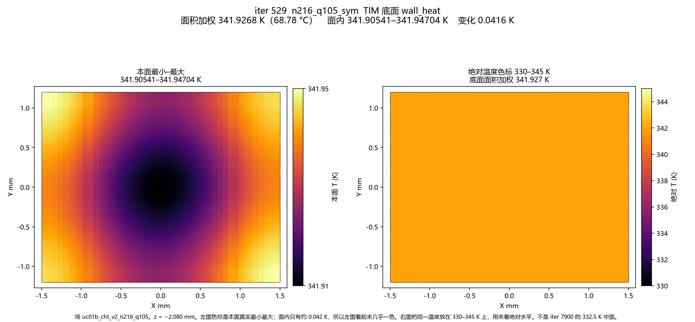
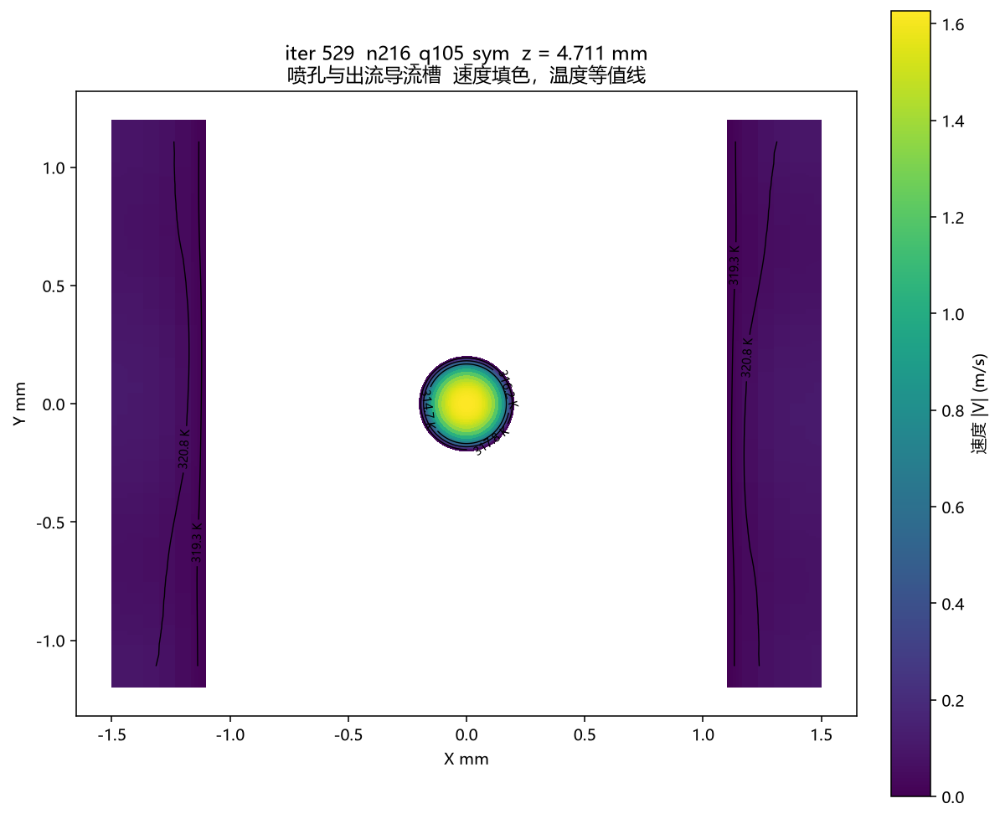
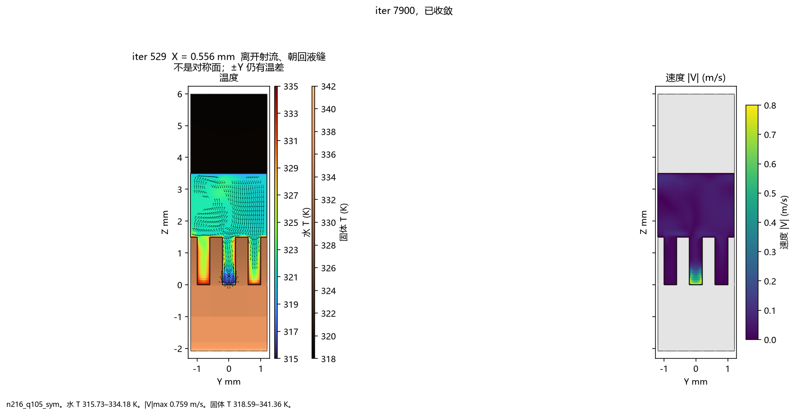

# UC-01b ICEM / Fluent 结果报告 v1.0

**场：** `fluent/uc01b_cht_v2_n216_q105_sym.cas.h5`（115480749 字节）与 `.dat.h5`（458025534 字节），2026-09-25 16:00。iter **529** 已收敛。从混合初始化重算，不读 7900 或 8587 的数据。

上一场 8587 在 X=0.556 mm 上 ±Y 温差中位 0.66 K、最大 5.70 K。本场同一位置中位 **0.631 K**、最大 **5.64 K**，**不称为对称**。X=0 上 ±Y 温差中位 0.0018 K，最大 0.092 K。两侧出流槽平均温度 320.616 K 与 320.614 K。

残差：`1.3062e-07  1.1074e-07  1.3559e-07  1.8577e-07  9.2473e-07  3.3142e-07  2.4924e-04`，随后 solution is converged。

| 量 | iter 529 |
|---|---|
| TIM 底 | **341.9268 K（68.78 °C）**，本面 341.905–341.947 K |
| TIM 中面 | 338.878–338.920 K |
| 铜–水 | **326.8120 K** |
| 出口 / 入口 | **320.8987 K** / 313.15 K |
| 静压差 | 入口邻接流体 1085.97 Pa，出口 0.001 Pa |
| U / Re_D | 0.9824 m/s / 597.1 |
| R(T_TIM−T_in) | **0.031942 K/W**（900.9 W） |
| R_conv / R_c-in | 0.015165 / 0.022557–0.026557 K/W |
| 能量 | 7.74875 / 8.14772 = 0.951，未闭合 |

网格剖面仍是 `figs/n216_mesh_*.png`，来自 `uc01b_cht_v2.msh`，不是温度。

## 剖面（iter 529，n216_q105_sym）

面积加权：TIM 底 341.9268 K，铜–水 326.8120 K，TIM–Cu 336.6716 K，出口 320.8987 K，入口 313.15 K。静压：入口邻接流体 1085.97 Pa，出口 0.001 Pa。施加 q'' 仍是 579282.4074074075 W/m²；dat 里的面热流数组不是 W/m²。质量流量积分未再打印。X=0 ±Y 温差中位 0.0018 K，X=0.556 mm 中位 0.631 K、最大 5.64 K，不称为对称。

| 图 | 范围 |
|---|---|
| `n216_sym_ztimcu_T.png` | TIM–Cu 336.650–336.692 K |
| `n216_sym_zcu_mid_T.png` | 铜中面 335.004–335.208 K |
| `n216_sym_z0_T.png` | 铜–水底面 332.67–334.34 K |
| `n216_sym_zrib_mid_T.png` | 肋中 331.258–332.398 K |
| `n216_sym_zrib_solid_T.png` | 肋顶 329.89–331.69 K |
| `n216_sym_zorif_solid_T.png` | 孔板固体 318.605–318.691 K |
| `n216_sym_zmid_TV.png` | 槽中水 313.40–332.32 K，1.406 m/s |
| `n216_sym_zgap_TV.png` | 间隙 313.15–324.14 K，1.656 m/s |
| `n216_sym_zorif_TV.png` | 圆孔水 313.15–322.38 K，1.627 m/s |
| `n216_sym_slitin_TV.png` | 缝入口 319.15–322.64 K，0.121 m/s |
| `n216_sym_zreturn_mid_TV.png` | 缝中段 318.702–322.375 K，0.111 m/s |
| `n216_sym_return_TV.png` | 出口 318.65–322.32 K，0.108 m/s |
| `n216_sym_y0_TV.png` | Y=0，313.15–333.33 K，1.699 m/s |
| `n216_sym_yside_TV.png` | Y=0.800 mm，317.84–334.23 K，0.458 m/s |
| `n216_sym_x0_TV.png` | X=0，313.15–334.13 K，1.699 m/s |

喷孔 |V| 0.034–1.627 m/s，两侧导流槽 |V| 0.00053–0.111 m/s，见 `n216_sym_zorif_slot_vel.png`。

